# Graph-based concordance and contextual tonicity/root-perception analysis with pitch memory for large chords

_Now that's a handful._

## tl;dr

A new algorithm for modelling the perception of complexity and tonicity of chords up to 8 notes. Tonicity is the measure of how likely the note is to be perceived as the "tonic", which may or may not correspond to the chord. This is done in real-time which, when used in conjunction with my [visualizer](https://github.com/euwbah/n-edo-lattice-visualiser), updates a model of pitch memory that tracks the listener's interpretation of up to 8 unique notes over time.

This model is not biased towards any tuning system or musical culture, in the sense that there was no hard-coding of weights/penalties/points from existing musical patterns/vocabulary I am familiar with. It has zero machine-learned/statistically regressed parameters, but has results that mostly agree with my subjective perception of consonance and root perception in Western/European musical harmony.

The only assumption made is that the instrument has a harmonic timbre (although this setting can be changed easily by modifying [dyad_lookup.rs](https://github.com/euwbah/dissonance-wasm/blob/master/src/dyad_lookup.rs)).

The model is only based on dyadic relationships between notes, but unlike most other chord complexity models with dyadic-based approaches, it:

1. Captures the gestalt of the chord voicing at different hierarchies of detail, without having to precompute permutations of polyadic interval combinations
2. Does not have harmonic duality (major and minor triads do not have the same complexity score)
3. Depends on the current musical context by keeping track of pitch memory over time

Two core concepts that make it work:

1. Treating subjective interpretations of chords as trees, where a (parent, child) edge is used to model the listener hearing the child note with respect to the parent note, e.g. `C->E` means E is heard as M3 of C. (See [Interpretation Trees](#generalizing-polyadic-complexity-using-interpretation-trees))
2. Using the asymmetry of the complexity of intervals about the octave to break the symmetry of chord duality/negative harmony. E.g., it is generally accepted that P4 and P5 do not have the same complexity, even though they are octave-duals of each other. This asymmetry is exploited so that overall chord perception is modelled more than the sum of its pairwise dyadic complexities. (See [Dyadic Tonicity](#base-case-dyadic-tonicity))

## Introduction

So far, I haven't found a measure of harmonic complexity/concordance/consonance that agrees with my own subjective perception of chordal and melodic tension and release. I started a bit of initial research towards this goal, and I wanted to document my current progress and thought process in a relatively informal and narrative manner here.

One year ago, I started work on [polyadic-old.rs](https://github.com/euwbah/dissonance-wasm/blob/master/src/polyadic-old.rs), which is an attempt to compute polyadic chord complexity and do root detection in a way that I am satisfied with. However, the computational cost of the full version of this algorithm is $N! \times (N-1)! \times M$ where $N$ is the number of notes in a chord, and $M$ is the number of candidate ratios that a new tempered note could be relative to the current harmonic context, and I relied a lot on aggressive pruning (via beam-search) to allow this algorithm to run in real-time at $O(N^3)$ as I play, but this aggressive pruning caused the results to deteriorate from the full version quite significantly.

However, in the old algorithm, I found the idea of using spanning trees to represent possible interpretations of a chord promising. This article serves as a journal of my thought process for my second (or third) attempt developing this idea, where complexity is computed as the aggregate complexity over possible [**interpretation trees**](#generalizing-polyadic-complexity-using-interpretation-trees).

For context, I needed some algorithm for my real-time detempering [music visualizer](https://github.com/euwbah/n-edo-lattice-visualiser) which heuristically detempers notes played in equal temperament into just intonation (JI) ratios, that is, finding the "most appropriate" JI ratio interval to represent a note that I played which could represent various possible JI ratios. This meant that on average, $N = 7$, and $M \approx 10$ so a full search would require around 30 million computations per note played.

I needed a concordance metric that can, for any arbitrary EDO (equal division of the octave) tuning:

1. Be **ridiculously fast**. Max 16ms acceptable latency per note played, preferably under 10ms. Each update tick needs to be able to run at least 4 times per second, all while a computationally intensive visualization, OBS screen recording, video streaming, and VSTs are also running.

2. **Keep track** of the current **harmonic context** and consider the **element of time**. Since music is contextual, prior notes must be able to affect the current model of concordance and tonality perception, and the root detection/concordance score should evolve over time even as a single chord is held.
   1. Ideally, rhythmic entrainment and strong/weak beat detection should be added too, but that's an equally huge problem to tackle later on.

3. Does **not have symmetry/negative harmony/duality assumptions**. The same chord voicing spelt in upwards intervals (e.g. C E G is a major triad spelt as M3 + m3 up from C) and downwards intervals (e.g., C Ab F being - M3 - m3 down from C) should not necessarily output in the same concordance scores or detected roots.

4. Perform some sort of **root detection**. Doesn't have to be perfect (which requires encoding cultural entrainment perfectly), but good enough to detect the root within $\pm 1$ fifths away from the actual root, so that my visualizer can display the correct enharmonic spellings of notes played (e.g., in 31edo, if I play a C major chord with A# approximating $7/4$, I would rather have the A# displayed as Bb< according to the conventions of HEWM, ASCII version of HEJI).

5. (Not yet implemented) Has proper modelling of the **physiology of hearing and psychoacoustic phenomena**, e.g., octave non-equivalence (tuning curves), combination/sum-and-difference tones, etc... So far, only a model of **lower interval limit** is implemented.

6. (Not yet implemented) A **model of cultural entrainment**, so that certain harmonic patterns (e.g., 2-5-1s, common licks/riffs/language/vocabulary) that are known to imply a certain tonality/root/mode will be considered by the model.

7. Except for rhythmic entrainment/beat detection and cultural/vocabulary entrainment models, all of the above features **should not be implemented with a black-box machine learning model**, but rather a fully explainable and interpretable algorithm that can hopefully give insight into (or at least a description of) the underlying logic (if any) of the harmony derived from the European musical tradition.

If you find any glaring shortcomings in the assumptions, find some part of the algorithm (or its implementation) redundant or incorrect relative to what I claimed it does, if you have a fresh perspective on this problem that can significantly speed up the algorithm, please reach out to me over Discord (@euwbah), Instagram (@euwbah), or email (euwbah [ａ𝐭] ġｍаíḷ [ɗօt] ċοm). I'd very much appreciate and enjoy any discussion on this topic!

Just to get this out of the way, the algorithm is tuned to my musical biases:

- Main influences: Romantic, Impressionist, and Black American Music.

- Secondary influences (partial understanding and practice): Renaissance polyphony (mainly Frescobaldi), Bach, Spectralism (mainly all the composers of the Plainsound Music Edition), and Algorave/live-coded music.

- Tertiary influences (significant exposure but no formal practice): Early music, Gamelan (especially Balinese), Maqam (especially Taqsim) and Carnatic music.

### Definitions

For the context of this writing,

**Consonance** is the subjective/cultural perception of pleasantness or stability in musical intervals. It can be influenced by context, culture, and individual listener preferences. Here, when I refer to "consonance" I mean my own subjective interpretation of what I think is consonant.

**Concordance** refers to a numerical heuristic score of the "objective/physiological/psychoacoustical complexity" of a musical interval, i.e., we assume that every human has an innate understanding of "complex" vs "simple" harmonies, and the concordance refers to a model of whatever "simple" is. Specifically, in [Harmonic Entropy](https://en.xen.wiki/w/Harmonic_entropy), the presence of timbral fusion, virtual fundamental, beatlessness, and periodicity buzz are signifiers of psychoacoustical concordance. It is assumed that concordance is a contributing factor to consonance, but not the only one. Additionally, concordance is usually measured with the absence of context/time.

**Complexity** is more specific than concordance. It usually refers algorithm/math used to compute the concordance score, rather than focusing on the perceptual/modelling aspect. In this document I will use concordance and complexity interchangeably, but I will be referring to mainly the algorithmic aspect, not the attempt at modelling a universal human perception of concordance.

**Tonicity** is a heuristic measure of "root"-perception in chords &mdash; a probability distribution of how likely a given pitch (either perceived in the present as external stimuli, in a listener's short-term memory, as a psychoacoustic phenomenon, or implied by cultural entrainment) will be perceived as the "root" or "tonic" of a chord (not necessarily the lowest note). I note that "root" is not rigorously definable, so I give my working definition below. Tonicity can be calculated for a single chord in stasis (played forever), or over time and in context (a chord progression/song).

> The tonicity distribution is an attempt to model my own understanding of Western/European harmony, something I have not yet seen in other literature (this is _not_ a softmax of a convolution kernel over pitch classes/FFT spectra, which I find more common in tonality/key-detection machine learning models). Though, my reading is probably outdated, so if you know of any references/people who share similar ideas, please let me know!

> [!NOTE]
> So far, this algo only consider pitches that are currently played or have been played, but psychoacoustic and cultural modelling is not yet implemented.

**Root**, as in the root of a chord/tonality is a reference pitch that is defined by musical culture and context. To give a more quantifiable definition, a note is more rooted/tonic if it is more likely for other notes in the context to be heard with respect to that note as a baseline. Conversely, a note is less rooted/tonic if it is more likely for it to be heard in relation to other notes as a baseline. Ideally, this should correspond to the "local key" of a song, i.e. a progression iii-vi-ii-V-I in C major would (probably) have C as the root, but in my experience, the melody and rhythmic phrasing can have a stronger influence on root perception than the harmony itself. For the purpose of this document, since I only need root perception to be accurate within $\pm 1$ fifths of the actual root (i.e., actual root is C but guessing G or F is also acceptable).

- E.g., suppose there are two notes, C and a major third E above it, and suppose this is the first thing you hear in a song. Will you hear C as scale degree 1 and E as the 3rd of C; or will you hear C as scale degree b6 of the tonic E? Whatever note you hear as "1" is the root (it can also be neither, but we will not consider that possibility for simplicity's sake).

### Inspiration & references

#### [A History of 'Consonance' and 'Dissonance' &mdash; James Tenney](https://www.plainsound.org/pdfs/HCD.pdf)

- Cultural and historical aspects of how the perception/definition of what is "consonant" evolves, tracing specifically the lineage of the European classical tradition.

- I also like the YouTube channel [Early Music Sources](https://www.youtube.com/c/EarlyMusicSourcescom).

#### [Height](https://en.xen.wiki/w/Height) or complexity functions (see also: [D&D's guide to RTT/Alternative complexities](https://en.xen.wiki/w/Dave_Keenan_%26_Douglas_Blumeyer%27s_guide_to_RTT/Alternative_complexities))

A purely mathematical, usually number-theoretic (like lowest common multiple, or sum of prime factors) or norm-based/functional-analytic measure of complexity of a JI ratio $\frac{n}{d} \in \mathbb{Q}$.
When I first encountered the concept of a height function, some limitations immediately stood out:

- No standard generalization to tempered non-JI intervals in $\mathbb{R}$. It is possible to use smoothing techniques (e.g., compute up to a certain limit and then interpolate using splines/linear methods), which I have used to some extent in my own implementation. [Harmonic entropy](https://en.xen.wiki/w/Harmonic_entropy) (see below) solves the issue using a spreading function.

- Any (commutative) generalization to chords of more than 2 notes results in negative intervals having the same complexity score as their positive counterparts. E.g., a 4:5:6 major triad and a 10:12:15 minor triad will score the same if we consider simple generalizations like taking the LCM of the 3 integers in the ratio, or just summing up the norms for each of the 3 intervals between the 3 notes. This doesn't reflect my (possibly subjective) experience of 4:5:6 sounding more simple than 10:12:15 (see [A note on complexity and duality/negative harmony](#a-note-on-complexity-and-dualitynegative-harmony))

- No direct link to psychoacoustic perception of consonance/dissonance, it measures literally the complexity of a number in itself, which works for the first few primes (modelling periodicity and the critical band Plomp & Levelt's model of concordance), but quickly diverges from human perception for higher primes as human perception cannot perfectly distinguish complex ratios.

#### [Tonal Consonance and Critical Bandwidth](https://www.mpi.nl/world/materials/publications/levelt/Plomp_Levelt_Tonal_1965.pdf) & [William Sethares' dissmeasure](https://sethares.engr.wisc.edu/comprog.html)

See also: [Python implementation by endolith](https://gist.github.com/endolith/3066664).

1. No restriction to JI-only intervals. It considers the pure frequency content of two complex tones (i.e., musical notes with harmonic partials) and measuring the "roughness".
2. Introduces the idea of "roughness" caused by the interaction of beating partials within the critical band: the gray area of when a beating/warbling sensation frequency is too low frequency to be heard as a pitch, but too high frequency to be heard as beats/rhythm, is claimed to be a major contributor to the perception of dissonance in intervals. This is claimed to model the physiology of the basilar membrane, where two frequencies that are too close together will cause physically overlapping excitation patterns on the membrane, causing the indistinguishability of pitches.

<iframe width="560" height="270" src="https://luphoria.com/xenpaper/#embed:(1%2F2)_%7Br440hz%7D%0A80%3A81-_%23_slow_audible_beating%0A50%3A51-_%23_fast_audible_beating%0A40%3A41-_%23_%3F%3F%3F_%22critical_band%22%0A30%3A31-_%23_almost_two_notes%0A20%3A21-_%23_two_distinguishable_notes%0A10%3A11-_%23_two_easily_distinguishable_notes" title="Xenpaper" frameborder="0"></iframe>

I appreciated that this model ties back to the physiology of hearing, which gives a sense of universality (even though in reality much more experiments are needed to confirm this).

It's also great that this is intrinsically a polyadic model (Sethares' algorithm by default considers partials of each individual note) and works **really** fast (relatively speaking, $O(N^2)$ is fast compared to whatever will be presented here).

However, the final result is effectively an unordered summation of (min-amplitude-weighted) critical band roughness scores over each pair of (sine) frequencies present in the spectrum, meaning that positive and negative chords still gave almost the same output, only disagreeing after a few decimal places due to some modelling of the lower interval limit curve. To me, that small difference is not sufficient to represent the perceived gap in complexity between major and minor.

- E.g.: [Dissonance (Consonant Triads) &mdash; Aatish Bhatia](https://aatishb.com/dissonance), clickable demo diagrams showing that both major and minor triads have the same dissonance score.

#### [Harmonic Entropy](https://en.xen.wiki/w/Harmonic_entropy)

This addressed several limitations of the above methods:

1. By reframing the problem as a probabilistic one, this allows inputs which are non-JI intervals, any real-valued cents interval will do &mdash; the ear hears the external stimuli of an interval of $c$ cents, but accepts detunings (or mishears) with probability $S(x - c)$ where $S$ is a spreading function, a probability distribution (e.g., Gaussian, Laplace, etc...) centred at 0 where $S(x - c)$ is the probability of hearing an interval as $x$ cents when the actual stimulus is $c$ cents. This spreading distribution is the basis of the rest of the approach.

2. By considering three-note combinations (3HE) instead of dyads, which is done by populating the search space with 2-dimensional points representing the 2 intervals between the 3 notes (as opposed to searching through points on the real line up to some Weil/Tenney height or Farey sequence iteration), this model is able to break the negative-harmony "curse" of using purely dyadic heights. The major `4:5:6` and corresponding "negative", minor `10:12:15`, have vastly different entropy/concordance scores.

I initially implemented a generalized $n$-HE algorithm in Ruby for livecoding in Sonic Pi, but found that any $N > 4$ quickly becomes intractable for real-time purposes. Every configuration of $N - 1$ intervals need to be considered. If I wanted 3-cent resolution (with intermediate values interpolated) for intervals up to a 1 octave span, that still quickly blows up to 25600000000 pre-computed points for only 5-note chords. There were some heuristic optimizations (e.g., lazily populating lattice points in direction of most entropy, assuming the inverse Fourier transform of the Riemann-zeta analytic continuation of HE was smooth/analytic for arbitrary dimensions), which I tried doing in Ruby, then Java, then Rust (though I lost the most of the projects in a corrupted old SSD, sad...). I did to get it working up to 7-HE, but the optimizations deteriorated the results until they were no longer useful and each operation still took 1s, which was unacceptable for my use case.

Things I really liked about HE:

- The probabilistic treatment felt correct for modelling the uncertainty of human perception of pitch. And this idea of extending to intervals in $\mathbb{R}$ via probabilistic interpretations/kernel smoothing functions was something I wanted to take further.

- It generalized to multiple intervals naturally, considering not just dyadic relationships but the entire gestalt of the chord by mapping chords to points in a higher-dimensional space.

What I didn't like was how quickly computations blew up when $N$ increases, and I was desperately looking for alternatives that preserved these two properties I needed in a complexity function, while not requiring a populating stage and a gargantuan search space (even after applying threshold cutoffs/interpolations) for 7/8-note chords.

#### Statistical/machine learning methods

These are very strong and computationally efficient methods for root/key detection, but only viable for 12edo, as they are trained/fitted for an existing corpus of music.

Some general ideas:

- Training an ML model on a melspectrogram (log frequency scale spectrogram/FFT)
- Using moving average amplitude of pitch classes over time, then fitting the distribution of the amplitudes of pitch classes to a known key profile via multilinear regression, machine learning, or musician's intuition, and comparing distributions by Kullback-Leibler divergence or $L^p$-norms (e.g., [Local Key Estimation from an Audio Signal Relying on Harmonic and Metrical Structures](https://hal.science/hal-00655781v2/document))

#### A note on complexity and duality/negative harmony

It is possible for the negative variant of a chord to have the exact same set of intervals in the same order, take for example, in 12edo, C E G B (Cmaj7), whose negative is C Ab F Db (which then is Dbmaj7). If we ignore the absolute frequency and things like the lower interval limit, then these two chords are indistinguishable up to transposition by a major 7th (or minor 2nd). Also in JI, the negative of 8:10:12:15 is itself (up to transposition). In this case, it would make sense for any complexity algorithm that is invariant over transpositions to assign the same complexity score to both chords.

However, for non-mirror symmetric chords, this property does not hold, e.g. the negative of 4:5:6:7 is 60:70:84:105, which I think should deserve a much higher complexity score:

<iframe width="560" height="180" src="https://luphoria.com/xenpaper/#embed:(1)%0A4%2F4_4%3A5_4%3A5%3A6_4%3A5%3A6%3A7--.%0A60%2F60_60%3A70_60%3A70%3A84_60%3A70%3A84%3A105--" title="Xenpaper" frameborder="0"></iframe>

Even though all 6 pairwise dyads are the same intervals, there are other psychoacoustic features like timbral fusion/combination tones/virtual fundamental that are much weaker in the latter than in the former.

Put another way, if all four notes were played together:

<iframe width="560" height="180" src="https://luphoria.com/xenpaper/#embed:(1)%0A4%3A5%3A6%3A7--.%0A60%3A70%3A84%3A105--" title="Xenpaper" frameborder="0"></iframe>

and as a result, in the context of a song with many other instruments/parts happening at once, I feel that for a seasoned ear-trained transcriber, it would be:

1. Harder to find all 4 notes in `4:5:6:7` than in `60:70:84:105`, i.e., some inner voice may be missed out when attempting to transcribe. (Play the following examples with other songs playing in the background to simulate the experiment).

    <iframe width="560" height="245" src="https://luphoria.com/xenpaper/#embed:(1)_%23_hear_the_missing_note%3F%0A8%3A10%3A12%3A14%3A18--._%7Br16%2F17%7D%0A8%3A10%3A14%3A18--._%7Br17%2F16%7D%0A%23_hear_the_missing_note_now%3F%0A60%3A70%3A84%3A105%3A135--._%7Br16%2F17%7D%0A60%3A70%3A105%3A135--" title="Xenpaper" frameborder="0"></iframe>

2. Easier to correctly identify any of the 4 notes in `4:5:6:7` than in `60:70:84:105`;

    <iframe width="560" height="245" src="https://luphoria.com/xenpaper/#embed:(1)_%23_hear_a_change%3F%0A60%3A70%3A83%3A105--._%7Br16%2F17%7D%0A60%3A70%3A84%3A105--.._%7Br17%2F16%7D%0A%23_hear_a_change_now%3F%0A64%3A81%3A96%3A112--._%7Br16%2F17%7D%0A64%3A80%3A96%3A112--." title="Xenpaper" frameborder="0"></iframe>

(Not a conclusive demo, just some anecdotal examples that may or may not work for you.)

To me, these two properties signify that `4:5:6:7` should be considered "simpler" than `60:70:84:105`. This intuition guides what I want this complexity score to output.

## Algorithm v1

I will describe my algorithm using the narrative steps that I took to arrive at the final version. Though long-winded, I hope that showing what _did not_ work can be as useful as showing what did.

The first version of the algorithm described is implemented in [polyadic-v1.rs](https://github.com/euwbah/dissonance-wasm/blob/master/src/polyadic-v1.rs) and uses [dyad_lookup-old.rs](https://github.com/euwbah/dissonance-wasm/blob/master/src/dyad_lookup-old.rs) for dyadic complexity/tonicity lookups.

### Goal 1: Crossing the dyadic-polyadic and micro-macro scale gap

I noticed that complexity scoring metrics either zoom in to the microscopic perspective of the complexity of each dyad and interactions between their partials (e.g., Sethares' dissmeasure, height functions) or zoom out to the macroscopic perspective to compute the score of the entire chord as a whole (e.g., HE or machine learning models).

The dyad-based methods are computationally efficient for 7-note chords, but miss out on the ability to model how a human perceives the whole chord at once and falls behind when it comes to issues like equating the complexity scores of harmonic duals.

The polyadic/gestalt methods are computationally expensive/intractable for 7-note chords, but they can model some of the gestalt and intuitive human perception of the chord.

It didn't make sense to have two fundamentally different models to describe the perception of one thing, and I want to explore the idea of the polyadic complexity/tonicity perception being an **emergent property** of the microscopic interactions between each pair of notes.

How can we emulate the perception of the whole chord by only evaluating 2-note pairs each time?

### Goal 2: No AI/ML (besides regressing simple statistical models)

There are models out there large enough to make sense of music. However, the two main problems I have with resorting to ML (machine learning) models are:

1. **No explainability**. There are models that are a working black-box that spits out sensible harmony, but the point of this exercise/experiment is to find whether there are any principles that influence complexity and root perception that can be made objective enough for a computer to evaluate. Of course, not everything can be explained through computation alone, but I am interested to find out the exact extent of what can and cannot be done. Hence, ML won't work for this purpose.

2. **Not enough training data**. The goal of this algorithm is to be able to analyze the complexity and tonicities of any arbitrary tunings. The inputs to the algorithm are raw Hz values, and the point is for any arbitrary frequencies from whatever tuning to be supported. The issue with most models that train on MIDI/FFT melspectrograms is the 12-centric quantization of pitch, which makes it impossible to generalize to arbitrary tunings in a way that is true to the "hidden human model" of pitch and complexity perception. Ideally, the algorithm should see 12edo as a special case of the underlying logic, and any other tuning system should have exactly the same underlying logic applied.

### Base case: Dyadic complexity

In this case, we only have two notes, and there are already many existing methods that give me a satisfactory complexity score for dyads. I will fall back to some variant of Sethares' dissmeasure that considers the first 19 harmonics. Depending on the specific part of the algorithm, I use a version that is better suited for compounding additively or multiplicatively, or normalized (with polynomial regression) so that all octaves (besides unison) have the same dyadic complexity score. All variants look more or less the same:

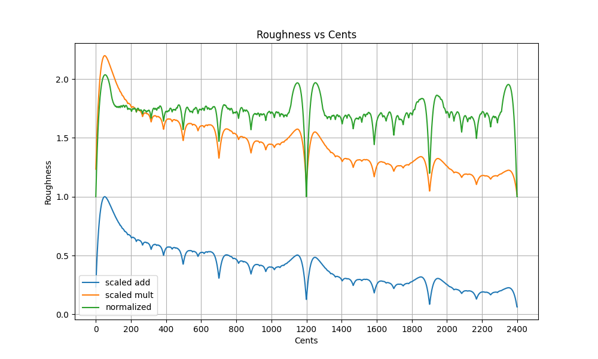

For the code that generated this plot, see the implementation of `DyadLookup` in [dyad_lookup.rs](https://github.com/euwbah/dissonance-wasm/blob/master/src/dyad_lookup.rs). The same results are stored in [sethares_roughness_31_5_0.95.csv](https://github.com/euwbah/dissonance-wasm/blob/master/sethares_roughness_31_5_0.95.csv).

Next, for the rest of this algorithm, we will need a measure of "tonicity", i.e. how likely a note will be perceived as the root/tonic of the chord/section/melodic fragment. Ideally, this number is supplied by an all-knowing oracle that always gives the correct answer.

Later I implemented a tonicity score that changes over time and depends on context, but first we need an initial tonicity model.

The initial tonicity heuristic can be thought of as an attempt to answer this question: Assume nothing has been played yet (no harmonic context) and the listener has no prior expectations. If both notes are played simultaneously for long enough for the listener to initially form an opinion, but short enough so that the initial opinion is not changed, which note will the listener hear as the root/tonic?

### Base case: Dyadic tonicity

For root perception, otonality first comes to mind. First a **vague** definition: we consider an interval to be **otonal** (as in overtones) if the top note can be seen as part of the harmonic series built from the bottom note. For various possible reasons, the top note in an otonal dyad is, more often than average, perceived relative to the bottom note. In a context-free vacuum, the bottom note of an otonal dyad is more "rooted", the same way a dyad is utonal (as in undertones) if the top note is more "rooted". (E.g., sing Do-Mi, and sing Mi-Do (or Le-Do) in a different key. Repeat a few times in random keys. Which note feels more like the root?)

> E.g., in a perfect fifth, C-G, we think of C as the root and G as the fifth. If we invert the interval across the octave so that G is now below C, then the perfect fourth G-C is utonal, and we still may think of C as the root and G as a fourth below the root (or historically, the C is a dissonant suspension that should resolve to B and/or D, then G is the root).

> Notice the **issue of duality** when it comes to root detection, a V-I progression in C major can also be a I-IV progression in G major. This can be solved by applying a cultural model (e.g., require two unique clausulae, use scale/mode/melody, etc...), but for this algorithm, as long as it answered within $\pm 1$ fifth of the "culturally correct" answer, I would consider it a success.

Now I say that the above definition of otonality is vague because I notice that otonality can be defined at multiple levels, sorted in decreasing strictness:

1. Strictly part of the harmonic series: only $1:k$ dyads are otonal for $k \in \mathbb{N}$, i.e., `3/1` is otonal but `3/2` is not.
2. Part of the harmonic series up to octave displacements while preserving the direction of the interval: any $2^n : k$ dyad is otonal as long as $2^n \le k$. E.g., `27/16` is otonal but `5/3` is not. `5/4` is otonal but `4/5` is not (direction flipped).
3. Any dyad whose higher note is higher up the harmonic series than the lower note, up to octave displacement, is otonal: any $2^n \cdot a : 2^m \cdot b$ for any $n, m \in \mathbb{N}$ where $a \le b$ and $2^n \cdot a \le 2^m \cdot b$ is otonal, and $n, m$ are such that $a, b$ are not even. E.g., `7/5` is otonal but `10/7` is not.
4. Any dyad which is _close enough_ to any interval that is otonal/utonal by the above definition is otonal/utonal respectively. E.g., we can consider `14/11`, and also 400 cents, otonal because it is close to `5/4` and `81/64`. The closer the interval is to other simple JI otonal/utonal intervals, and the simpler (lower height) of those JI intervals, the stronger the pull towards that classification.

These levels of definitions create a continuum of otonality/utonality. @hyperbolekillsme on the [Xenharmonic Alliance Discord](https://discord.gg/QaQQpw7fN5) generated a plot using [this python script](https://discord.com/channels/332357996569034752/947247604100649000/1395090206247358474) which evaluates the otonality of intervals (otonality in blue line):

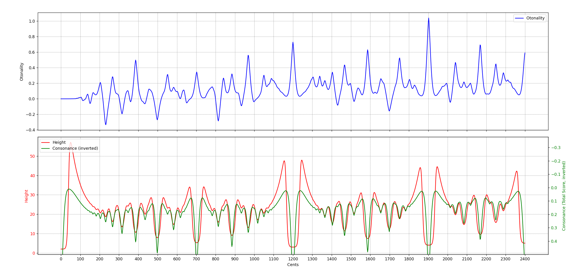

This was done by computing the otonality component for the numerator and denominator of each JI $\frac{n}{d}$ up to a fixed height using the multiplicative Euler method: e.g., $\mathrm{comp}(n) = \prod_i (p_i - 0.5)$, where $n = \prod_i p_i$ and $p_i$ are primes. Then, raw otonality for a JI interval $\frac{n}{d}$ is computed as
$$
\mathtt{otonality}(n, d) = \log_2 \mathrm{comp} (n) - \log_2 \mathrm{comp} (d).
$$

For any interval (not necessarily JI), its otonality is computed by finding a set $\mathcal{J}$ of JI approximations via `find_top_approximations`, then those approximations are scored/weighted by `score = complexity_score * accuracy_score`. The otonality is the weighted average `otonality(a, b) * score`.

This otonality scoring metric is consistent with definition 4. of otonality above.

One easy method to apply otonality to obtain an initial heuristic of tonicity is to sum up, for each pair of notes in a chord, how otonal each pair is. The more otonal a pair is, the more we increase the tonicity score of the lower note in the pair.

However, there are two things that prevented me from taking this approach:

1. The otonality curve itself didn't agree with my intuition for rootedness. For instance, I would think that in a vacuum, a `3/2` perfect fifth C-G, or even more so, a stack of perfect fifths C-G-D-A, would imply more tonicity for C than a single `5/4` major third. This does not work with the otonality curve which ranks `5/4` and `7/4` much more otonal than `3/2`.

2. I don't think that otonality can substitute for tonicity/root perception.

Rather than otonality, I thought about what other properties I could exploit to highlight the asymmetry between "root" and "non-root" notes. Specifically, I was drawn to the asymmetry of the roughness curve itself.

To show what I mean by "asymmetry", let's suppose that:

1. The duals of negative harmony are equivalent.
2. Octaves are equivalent.

Then, P5 = `3/2` and its dual -P5 = P4 - 1 octave = `2/3` must be equivalent. And because of octave equivalence, `2/3` should be equal to P4 = `4/3`.

However, the roughness of `3/2` and `4/3` are not equal. This is the asymmetry that I want to exploit.

From my subjective musical culture, `3/2` reinforces the lower note as root and `4/3` reinforces the higher note as root. Since `3/2` has lower roughness than `4/3`, I hypothesize that if an (octave-shifted) inverted interval has higher roughness than the original interval, then the original interval reinforces the lower note as root more strongly than the higher note, and vice versa.

An intuitive explanation: If an interval has lower roughness than its octave-inverted counterpart, then the lower note of the original interval "wants" to be the lower note. Conversely, the inverted configuration having a higher roughness than the original interval could indicate that the inverted configuration is less stable.

Using this idea, I generated a plot for the initial heuristic tonicity score of a dyad in vacuum:

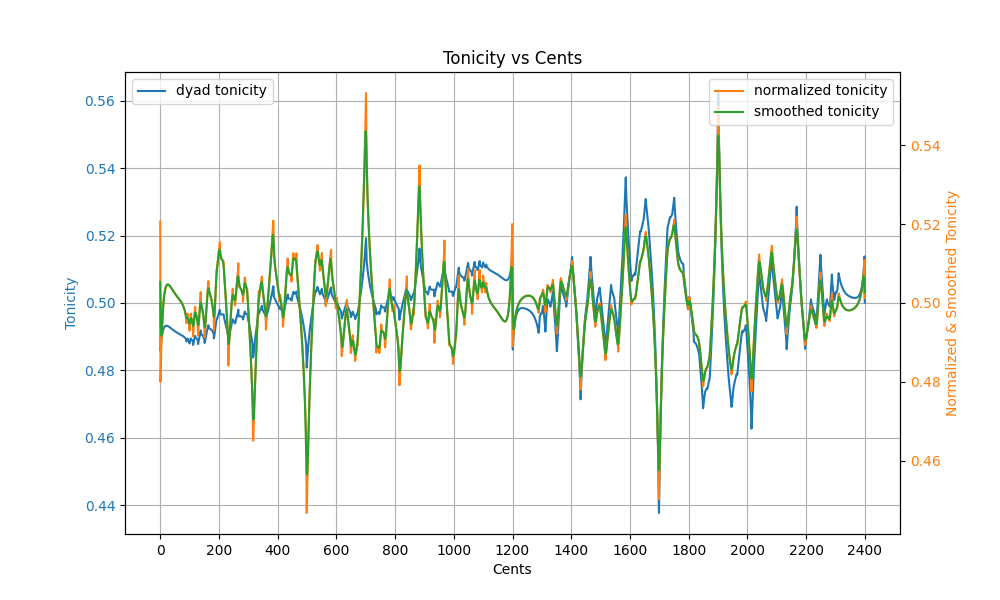

The code that generated this plot can be found in the implementation of `TonicityLookup` in [dyad_lookup.rs](https://github.com/euwbah/dissonance-wasm/blob/master/src/dyad_lookup.rs), and the results are stored in [dyad_tonicity_19_5_0.95.csv](https://github.com/euwbah/dissonance-wasm/blob/master/dyad_tonicity_19_5_0.95.csv).

The higher the tonicity, the more likely the lower note is to be heard as root/tonic.

The blue line is the raw dyad tonicity, computed as
$$
\mathtt{raw\_tonicity} = \frac{\mathtt{rough}(\hat{I}^{-1})}{\mathtt{rough}(I) + \mathtt{rough}(\hat{I}^{-1})}
$$
where `rough` is the normalized dyadic roughness (the green line in [Base case: Dyadic complexity](#base-case-dyadic-complexity)), $I$ is the interval in cents, and $\hat{I}^{-1} = -I + 1200 \cdot (2 \lfloor \frac{I}{1200} \rfloor - 1)$ is its inverted counterpart, placed within the same octave as $I$.

The orange line is the normalized tonicity. Because Sethares' roughness intrinsically decreases as two intervals get further and further apart, there is a drifting bias such that larger intervals always have lower roughness and thus higher tonicity than smaller intervals. To correct for this, each octave is fitted to a degree 5 polynomial and that is subtracted from the raw tonicity to obtain a flatter version, then the result is normalized with mean 0.5 and variance 0.0001. The choice of variance here is arbitrary, but I just needed to make the tonicity scores fit within 0.4-0.6 for numerical stability in the later time/context-sensitive parts of this algorithm.

Finally, the green line (smoothed tonicity) is obtained by applying Gaussian kernel smoothing with 21 bins ($\pm 10$ cents) at $\sigma = 5$ cents, since humans don't perceive pitch with infinite precision, a lot of the sub-cent jitters are not very meaningful. This smoothed tonicity is the one used in the rest of the algorithm.

Generally, I am quite happy with the smoothed tonicity (green), except for the fact that `5/3` scores higher tonicity than `5/4` (to my cultural bias, `5/3` in a vacuum should imply a third note `4/3` as tonic instead). At this point in time, I didn't think it would be an issue, so I just moved on.

### First step: Major vs minor triads

Now that I had a way of initially guessing which note is more likely the root in a dyad, I can move on to triads.

The main challenge & improvement from existing dyad-only methods was to ensure that the 5-limit JI major triad `4:5:6`; and the minor triad `10:12:15` do not have the same complexity score. The minor triad should be more complex.

My thought process:

- In a vacuum, when I hear both `4:5:6` and `10:12:15`, I would instinctively hear the lowest note as the root, the top note as a fifth coloring above the root, and the middle note as the note that helps identify the quality of a chord.
- I would judge the notes in the triad relative to the most rooted note, followed by the fifth, then last (or almost never) the middle note. E.g., if I hear C-E-G in a vacuum, I wouldn't instinctively think of judging C as the b6 of E unless forced to by some other context.
- Therefore, there must be a way to ascertain how "tonic" each note in the triad is, then use that to weight the importance of each dyad's complexity score.

Suppose we don't weight by "tonicity", and let $a, b, c$ be the complexity scores of the dyads C-G, C-E, and E-G respectively, where $a < b < c$.

Also (assuming complexity is invariant to transposition), $a, b, c$ will be the complexity of C-G, Eb-G, and C-Eb in the minor triad.

If we only sum up the dyadic complexities, both C-E-G and C-Eb-G will have the same total complexity of $a + b + c$.

However, now suppose we have tonicity scores for each note. Let $t_C, t_E, t_G$ be tonicity scores for the major triad and let $s_C, s_{E\flat}, s_G$ be tonicity scores for the minor triad.

If we have a function $f(k, t_X, t_Y)$ that takes in dyadic complexity $k$ and tonicity scores of notes $X$ and $Y$ and spits out a weighted complexity score, then the total complexity score for the major triad can be
$$
    f(a, t_C, t_G) + f(b, t_C, t_E) + f(c, t_E, t_G)
$$
and that of the minor triad is
$$
    f(a, s_C, s_G) + f(c, s_C, s_{E\flat}) + f(b, s_{E\flat}, s_G)
$$
Thus, if $(s_C, s_{E\flat}) \ne (t_E, t_G)$ and $(s_{E\flat}, s_{G}) \ne (t_C, t_E)$, then the complexity of the major triad can be different from that of the minor triad.

Some choices of $f$:

- $f(k, t_X, t_Y) = k \cdot (t_X + t_Y)$
- $f(k, t_X, t_Y) = k \cdot t_X \cdot t_Y$

Let's work out some numbers to see if this works.

For now, we assume a very simple heuristic to get the tonicity of the notes in the triad:

1. For each dyad, add the `dyadic_tonicity` to the lower note's raw tonicity score, and add `1 - dyadic_tonicity` to the higher note's raw tonicity score.
2. Take the average tonicity score for each note by dividing by the number of dyads it is part of (i.e., divide by $N - 1$ where $N$ is the number of notes in the chord).
3. Apply softmax on average tonicity scores to get a probability distribution summing to 1.

According to the comutations in [Base case: Dyadic complexity](#base-case-dyadic-complexity) and [Base case: Dyadic tonicity](#base-case-dyadic-tonicity), we have:

| Dyad | Dyadic complexity | Dyadic tonicity |
| - | - | - |
| C-Eb and E-G | 1.764 | 0.4983 |
| C-E and Eb-G | 1.759 | 0.5043 |
| C-G | 1.512 | 0.55 |

Raw tonicity scores (Major):

- C: $(0.5043 + 0.55) / 2 = 0.52715$
- E: $(0.4983 + (1 - 0.5043)) / 2 = 0.497$
- G: $((1 - 0.55) + (1 - 0.4983)) / 2 = 0.47585$
- $\sum_N e^{t_N} = 4.94726135$

Raw tonicity scores (Minor):

- C: $(0.4983 + 0.55) / 2 = 0.52415$
- Eb: $((1 - 0.4983) + 0.5043) / 2 = 0.503$
- G: $((1 - 0.5043) + (1 - 0.55)) / 2 = 0.47285$
- $\sum_N e^{s_N} = 4.94725811$

Softmax tonicity scores (Major):
- C: $e^{0.52715} / 4.94726135 = 0.3424$
- E: 0.3323
- G: 0.3253

Softmax tonicity scores (Minor):
- C: 0.3414
- Eb: 0.3343
- G: 0.3243

Using $f(k, t_X, t_Y) = k \cdot (t_X + t_Y)$, we have:

$$
\begin{aligned}
\text{comp}(C,E,G) &= 1.512 \cdot (0.3424 + 0.3253) + 1.759 \cdot (0.3424 + 0.3323) + 1.764 \cdot (0.3323 + 0.3253) \\
&= 3.3563661 \\
\text{comp}(C,E\flat,G) &= 1.512 \cdot (0.3414 + 0.3243) + 1.764 \cdot (0.3414 + 0.3343) + 1.759 \cdot (0.3343 + 0.3243) \\
&= 3.3569506
\end{aligned}
$$

Or using $f(k, t_X, t_Y) = k \cdot t_X \cdot t_Y$:
$$
\begin{aligned}
\text{comp}(C,E,G) &= 1.512 \cdot (0.3424 \cdot 0.3253) + 1.759 \cdot (0.3424 \cdot 0.3323) + 1.764 \cdot (0.3323 \cdot 0.3253) \\
&= 0.55923229148 \\
\text{comp}(C,E\flat,G) &= 1.512 \cdot (0.3414 \cdot 0.3243) + 1.764 \cdot (0.3414 \cdot 0.3343) + 1.759 \cdot (0.3343 \cdot 0.3243) \\
&= 0.55942730643
\end{aligned}
$$

Note that the minor triad is only very slightly more complex than the major triad. The major-minor complexity gap can be widened further by decreasing the softmax temperature to give more opinionated tonicity scores, or by tweaking $f$.

This is just an initial heuristic tonicity score, but I will later use a contextual model of tonicity that becomes more opinionated over time, so the small difference between tonicities is not of concern for now.

### Generalizing: Polyadic complexity using interpretation trees

We can trivially extend to 7-note chords from the triad case by repeating the same sum-of-tonicities and softmax normalization to get tonicities of each note in the chord, then summing up the weighted dyadic complexities for each pair of notes.

However, in my experiments, this completely misses the gestalt of the chord. E.g., a common voicing for a C13b9 chord is C Bb for the left hand and E A Db in the right hand. Now, the E A C#/Db forms an A major triad upper structure that easily stands out in the chord (because of its consonance). At the same time, I recognize C Bb E as a dominant 7th fragment.

<iframe width="560" height="175" src="https://luphoria.com/xenpaper/#embed:(1)%7Br261.3hz%7D%0A%5B0_10_'4_'9_''1%5D---%0A%5B0_10%5D--%5B'4_'9_''1%5D--" title="Xenpaper" frameborder="0"></iframe>

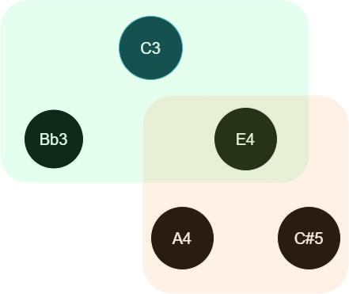

The **interpretation tree** above implies that we hear A and C# with respect to E as a "subroot", and we hear Bb and E with respect to C as the root. Of course, this is not the only way to interpret this voicing, so the actual algorithm should find a way to aggregate over different interpretations.

To evaluate complexity based on this particular interpretation tree (where root and subtrees are fixed):

1. Compute the initial tonicities of the notes in this set-up, we use the heuristic initial tonicity computation in the [first step](#first-step-major-vs-minor-triads). Though in practice, notes are only added one at a time, so we can assume that the contextual tonicities is already given except when adding new notes.
2. Perform a DFS (depth-first search) starting from the root node (C3):
   1. Compute the local relative tonicity amongst all children. I.e., assuming the current tonicity scores of the entire chord from context, we take the distribution conditioning on the parent node being the root. See below for various methods for obtaining local tonicity scores.
   2. For each child of the parent:
      1. Compute the complexity of child subtree recursively. If the child is a leaf node, it has complexity 0. This value should be contained in $[0,1]$.
      2. Obtain the edge complexity in $[0,1]$, which is obtained from a lookup table from the pre-computed dyadic complexities between the parent and the child. This complexity should model perceived roughness, thus the same interval at different octaves should generally have lower complexity the further apart they are. However, the raw additive Sethares' roughness (blue line labelled "scaled add" in the [graph](roughness_scaled_add_vs_cents_v1.png)) is normalized to have a peak roughness that halves every octave. Instead, I want to aim for peak roughness to be $0.86^n$ at the $n$-th octave, so we simply multiply the raw additive roughness by $\left(\frac{0.86}{0.5}\right)^n$ for $n = 2^{\text{cents} / 1200}$ octaves.
      3. The child's complexity (in the range 0-1) is computed as:
          $$
            \text{comp} (a, s) = \frac{a+s}{2} \cdot \left(1 + \frac{1}{2}(a-s)\right)
          $$

         where $a \in [0,1]$ is the dyadic complexity between parent and child and $s \in [0,1]$ is the subtree complexity of the child subtree.

         [Link to desmos](https://www.desmos.com/calculator/pqopcbjxkl)

         This formula was chosen so that:
            - $\text{comp} (0.5, 0.5) = 0.5$: neutral complexity of both edge and subtree should return neutral 0.5.
            - $\mathbb{E} [\text{comp} (A,S)] = 0.5$: average complexity 0.5 should be preserved in recursive steps.
            - If $0 < a < s < 1$, $\text{comp} (a, s) < \text{comp} (s, a)$: edge complexity should have more effect than subtree complexity on overall complexity. This ensures more intuitive root choices will score lower complexity. If this inequality was flipped, optimizing for low-complexity roots will optimize for interpretation trees where the root is the largest "dissonance contributor" &mdash; in the sense that if the root is removed, the remaining notes (which are siblings/descendants of the children) will be the most consonant.
            - $\text{comp}(0,0) = 0$ and $\text{comp}(1,1) = 1$: bounding min/max cases should give min/max values
            - $\text{comp}(a, s) \in [0,1]$ is bounded with the same bounds as inputs.

         > [!QUESTION]
         > Question: is there a better way to combine edge complexity and subtree complexity, in a way that is explainable by human perception, rather than just using intuitive mathematical properties?
         >
         > This is not the final edge complexity vs. subtree complexity balancing method, a modification will be made later.
   3. Then, the total complexity of the parent's subtree is computed as the weighted sum of all its children's complexities, weighted by local tonicity of each child.
3. The final complexity, fixing this interpretation tree of the voicing, is obtained when the root node (C3) is reached.

I have considered different options for evaluating the local tonicity distribution, conditioning on the parent note as root:

1. Normalize tonicity scores of child nodes to 1. This is computationally efficient, but the issue would be that if a child node has very low tonicity, the complexity of the child's subtree (if any) will be discounted.
    - Problem: If we optimize root choice and tree structure for low complexities at the subtree level there would be a feedback loop where low-tonicity subtree roots are preferred, which doesn't make sense since the main point of the model is for parents to have higher tonicity than their children.
        - Solution 1: decouple tonicity calculation from subtree complexity computation, then this issue is avoided.
            - E.g., we can compute the target tonicity by comparing the distributions of complexity scores obtained by fixing each note as root. E.g., increase the tonicity of a note if the minimum complexity score when that note is root is lower than the rest, and scale the increase by the confidence (e.g., we can measure confidence as the entropy of complexity score distributions fixing each note as root, or as the inverse of the variance of complexity scores)
        - Solution 2: Intuitively, any node with low (global & local) tonicity should not have many children, as the point of tonicity is to model how likely a note is to be heard as the baseline reference for other notes. To regularize this, we can penalize configurations where low-tonicity parents have many children which evades the complexity contributed by edges formed between the parent and their children. Alternatively, we can penalize when children have higher tonicity than their parents.

2. Instead of computing local tonicity scores using only tonicities of direct children, the relative tonicity of each child will be the sum of tonicities of the child itself and all its descendants (or some kind of aggregation function that increases if the tonicity of all elements in the subtree increases, e.g. softmax of values $T_i$ where $T_i$ is the sum of tonicities for the $i$-th child's subtree).
   - **This will be the method I am currently developing for this article**. This method comes with its fair share of problems which we will go through later.

3. Compute local tonicity of each child using the reciprocal of the child's subtree complexity. The intuition here is that if a subtree is a concordant/stable upper structure, it is more likely to be heard as a reference point over other substructures.
    - Problem 1: If the child is a leaf node, there is no complexity scoring for just a single note. When comparing the tonicities of child leaf nodes to each other, we can use the global tonicity context and normalize their per-note global tonicities to get a local tonicity distribution. However, how do we compare a leaf node to a non-leaf node, such as in the C13b9 example where Bb is a child leaf node of C but E-A-C# is a child subtree of C?
        - Solution: mix both local tonicity from global context and reciprocal subtree complexity. For a non-leaf note node $N$, let $t_N$ be its global tonicity and $K$ be the subtree complexity, then we can define the mixed tonicity as $m_N := t_N + \rho \cdot (1 / \text{K} - 1 / \hat{K})$ where $\rho$ is a parameter controlling how much bonus we give to low-complexity subtrees, and $\hat{K}$ is the expected subtree complexity score of all subtrees with the same number of notes of the subtree at $N$.
        - This solution introduces more parameters and the computation of $\hat{K}$ for each subtree size is memoizable but not trivial, so I have not experimented with subtracting $1/\hat{K}$ yet.
    - Problem 2: The subtree complexity is computed as the sum of child subtree complexities weighted by the child subtree's tonicity. However, now the child subtree's tonicity is simply the reciprocal of its complexity, so now multiplying the local tonicity and complexity simply cancels out to a constant!
       - Solution: from the distribution created from the mixed tonicities $m_N$ as a solution to Problem 1 above, we combine the reciprocal subtree complexity with an edge-specific weight in a non-linear way (e.g., multiplying the dyadic complexity and the reciprocal subtree complexity).

> [!NOTE]
> In my initial attempt ([polyadic-old.rs](https://github.com/euwbah/dissonance-wasm/blob/master/src/polyadic-old.rs)), I have gone with method 3, however, this raised the computational complexity so high that the algorithm can no longer run at real time unless aggressive beam pruning was done, but that severely impacted accuracy.
>
> In my current attempt, I aim to use method 2, but even then the computational complexity is very high, and some heuristics must be done to prune the search space of possible trees.

This completes the first part &mdash; now we can evaluate the complexity given a single subjective interpretation of how a polyadic chord voicing is broken down.

### Generalizing: Polyadic tonicity evolving with time

The next challenge: How to aggregate over different interpretations of the same voicing to form a single complexity score?

1. Going back to the C13b9 voicing example, note that there are many other ways of interpreting this particular voicing, and not necessarily with C as the root. Though, certain ways of interpreting will feel more intuitive than others. How do we model this?
   - E.g., we could also interpret the voicing as an Bbdim (Bb Db E) over an Am dyad (A C), but this does not feel intuitive to me.
     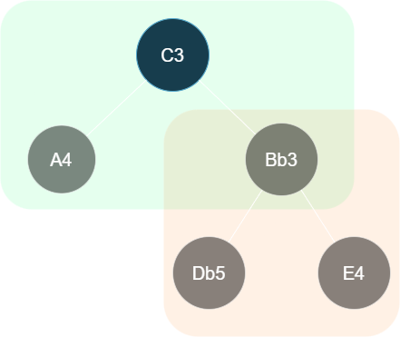

   > [!NOTE]
   > At this current stage of devising this algo, I assumed that scoring the intuitiveness of the tree interpretation was not necessary since the complexity scores aggregated from each root of the interpretation tree are fed back in to the algorithm to update the tonicity scores, which I assumed meant that tonicities should converge to a value that depends on the intuitiveness of the trees formed with that root.
   >
   > In the [next step](#the-big-problem-duality-is-still-hiding), I will show why this is not sufficient.

2. How do we update the perceived tonicity of notes according to the aggregated polyadic complexity calculations (instead of relying on the heuristic polyadic tonicity in [First step: Major vs minor triads](#first-step-major-vs-minor-triads))?

To give another example, compare this voicing of 13b9 to other voicings with octaves shifted around:

<iframe width="560" height="235" src="https://luphoria.com/xenpaper/#embed:(1)%7Br261.3hz%7D%0A%5B0_10_'1_'4_'9%5D---%0A%5B0_1_9_'4_'10%5D---%0A%5B0_9_'1_'4_'10%5D---%0A%5B4_9_'0_'1_'10%5D---" title="Xenpaper" frameborder="0"></iframe>

I think it's fair to say all these voicings of C13b9 have differing perceived complexities, and there is a reason why some are more commonly played than others.

When there are more notes, certain subsets or upper structures stand out as strong units on their own, and usually depends on the exact voicing being played. This may very well just be a cultural artifact of how contemporary western harmony is organized, but I wanted something in the model that can capture this idea.

This is what a **full single-tick update of the algorithm** should look like, assuming no new notes were played, no old notes were deleted from the context, and the tonicity values of all notes in the chord are known and correct:

1. Iterate over different interpretations of the same voicing (finding different substructures)

2. Identify which choices of tree organization and root choices are more likely than others
     - The likeliness of root choices are used to update the global tonicity values.

3. Aggregate substructures into individual units, where each substructure has a "structure tonicity" and "structure complexity" score, weighted amongst other sibling leaf nodes/substructures at that level.

Step 3 is already handled by the single-interpretation case.

For step 2, we have to devise a measure of likelihood. For now, we focus on the simpler problem of measuring the likelihood of root choices, which directly corresponds to the tonicity scores. (In the next section, we find that we still have to model the intuitiveness/probability of perceiving each tree, see [The big problem: Duality is still hiding](#the-big-problem-duality-is-still-hiding))

Working through an example for triads, we have to think about 3 tree configurations and 3 different roots each:

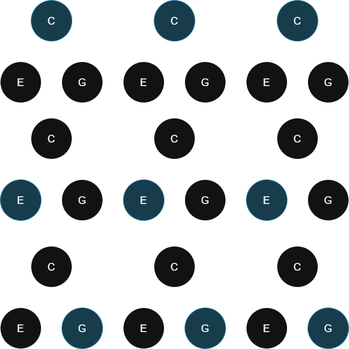

Using the interpretation tree complexity evaluation from [Generalizing: Polyadic tonicity with substructures](#generalizing-polyadic-tonicity-with-substructures), we can compute the complexity score for each of the 9 configurations above. An example of how this can be done using depth-first search (DFS) in the triadic case is provided in [triad_sts_computation_example.py](triad_sts_computation_example.py). Running `test_one_iteration()` gives the result:

```txt
C
|---E
|---G
Complexity: 0.63550
___________________________
C
|---E
    |---G
Complexity: 0.75960
___________________________
C
|---G
    |---E
Complexity: 0.55761
___________________________
Arithmetic mean complexity for root C: 0.65090
Harmonic mean complexity for root C: 0.64056
Inverse exp. weighted mean complexity for root C: 0.64407
Exp. weighted mean complexity for root C: 0.65789


E
|---C
|---G
Complexity: 0.76150
___________________________
E
|---C
    |---G
Complexity: 0.71398
___________________________
E
|---G
    |---C
Complexity: 0.71839
___________________________
Arithmetic mean complexity for root E: 0.73129
Harmonic mean complexity for root E: 0.73067
Inverse exp. weighted mean complexity for root E: 0.73083
Exp. weighted mean complexity for root E: 0.73175


G
|---C
|---E
Complexity: 0.63800
___________________________
G
|---C
    |---E
Complexity: 0.55702
___________________________
G
|---E
    |---C
Complexity: 0.76340
___________________________
Arithmetic mean complexity for root G: 0.65281
Harmonic mean complexity for root G: 0.64204
Inverse exp. weighted mean complexity for root G: 0.64569
Exp. weighted mean complexity for root G: 0.66008
```

Now this test assumes an initial uniform tonicity, where all C, E, and G have the same tonicity probability of $1/3$.

Even then, we notice that the average complexity scores per choice of root are not equal. The lowest average complexity is obtained when C is the root, followed by G, then E, which I find is an acceptable answer to the question: "With no prior musical context, if you hear a simple C-E-G triad in root position as the first stimulus of a song, and given that the key of the song is either C, E, or G major or minor, which key do you think the song will be in?". I find the slight ambiguity between C and G acceptable because of the duality problem mentioned in [Base case: Dyadic tonicity](#base-case-dyadic-tonicity).

The results of this test hints that the per-root aggregated polyadic complexity scores can be used directly to nudge the tonicity context towards favouring roots with lower complexity scores.

Four different aggregation methods were tested: Where $k_i$ is the complexity score for the $i$-th interpretation tree of the same root,

1. Arithmetic mean: $\frac{1}{N} \sum_{i=1}^N k_i$
   - Complexities are weighted equally.
2. Harmonic mean: $N / \sum_{i=1}^N (1 / k_i)$
   - Complexities with smaller values are weighted more heavily.
3. Inverse exponential weighted mean: $\sum_{i=1}^N k_i e^{- k_i} / \sum_{i=1}^N e^{- k_i}$
   - Complexities with smaller values are weighted more heavily, but less aggressively than harmonic mean.
4. Exponential weighted mean: $\sum_{i=1}^N k_i e^{k_i} / \sum_{i=1}^N e^{k_i}$
   - Complexities with smaller values are weighted less heavily.

Initially, I was inclined to use either the harmonic or inverse exp weighted mean, because intuitively I thought that if a particular root interpretation allows for a few interpretation trees to have significantly lower complexity than the rest, then the listener should update their subjective model of tonicity to favor hearing the current music with respect to whichever root that allows for an interpretation that obtains the least complexity.

However, in terms of raw numbers, I wanted to widen the gap between the probability of C being the root and the probability of G being the root. Hence, I am currently considering using the exponentially weighted mean to aggregate per-root complexities. Musically speaking, this means that if any root choice allows for the listener to construct a high-complexity interpretation, that high-complexity interpretation would affect the overall complexity score of that root choice more significantly than a low-complexity interpretation would, e.g., multiple low-complexity interpretations are needed to "balance out" a single high-complexity interpretation.

> [!NOTE]
>
> This aggregation method is not final &mdash; this will be improved in the next sections.

Now that the per-root aggregated complexities are computed, we can update the global tonicity scores as follows:

1. Compute target tonicities as the softmax of negative per-root complexities (adding 1 for numerical stability). Where $t_i$ is the target tonicity of the $i$-th note, $c_i$ is the aggregated complexity scores of interpretation trees with note $i$ as the root, and $\tau \approx 0.5$ is the softmax temperature (which is lowered from the baseline of 1 to make the tonicity distribution more opinionated):
   $$
     t_i = \frac{\exp((1 - c_i) / \tau)}{\sum_{j} \exp((1 - c_j) / \tau)}
   $$

2. Perform smooth update of global tonicity context towards the target tonicities. $\hat{t}_i$ is the current global tonicity of note $i$, and $\alpha$ is the smoothing factor (higher = slower update), we compute the next iteration's global tonicity $\hat{t}'_i$ using
   $$
    t'_i = \alpha \hat{t}_i + (1 - \alpha) t_i
   $$
   then we normalize with
   $$
    \hat{t}'_i = \frac{t'_i}{\sum_j t'_j}
   $$
   such that $\sum_i \hat{t}'_i = 1$ is a tonicity distribution.

The updated tonicity scores are now fed back to the complexity computation for the next tick.

This process continues indefinitely until the music stops.

An example of this computation is provided in [triad_sts_computation_example.py](triad_sts_computation_example.py) in the function `test_tonicity_update()`. Running it to update the tonicities of a simple C-E-G triad with parameters `iterations=30, smoothing=0.7, temperature=0.5` and assuming an initial uniform tonicity of $\hat{t}_i = 1/3$ gives the result:

```txt
Iteration 1      target: ['0.34986', '0.30181', '0.34833'] ctx: ['0.33829', '0.32388', '0.33783']
Iteration 2      target: ['0.34994', '0.30163', '0.34843'] ctx: ['0.34179', '0.31720', '0.34101']
Iteration 3      target: ['0.35000', '0.30150', '0.34850'] ctx: ['0.34425', '0.31249', '0.34326']
Iteration 4      target: ['0.35004', '0.30141', '0.34854'] ctx: ['0.34599', '0.30917', '0.34484']
Iteration 5      target: ['0.35007', '0.30135', '0.34858'] ctx: ['0.34721', '0.30682', '0.34596']
Iteration 6      target: ['0.35009', '0.30130', '0.34860'] ctx: ['0.34808', '0.30517', '0.34676']
Iteration 7      target: ['0.35011', '0.30127', '0.34862'] ctx: ['0.34869', '0.30400', '0.34732']
Iteration 8      target: ['0.35012', '0.30125', '0.34863'] ctx: ['0.34912', '0.30317', '0.34771']
Iteration 9      target: ['0.35013', '0.30123', '0.34864'] ctx: ['0.34942', '0.30259', '0.34799']
Iteration 10     target: ['0.35013', '0.30122', '0.34865'] ctx: ['0.34963', '0.30218', '0.34819']
Iteration 11     target: ['0.35014', '0.30121', '0.34865'] ctx: ['0.34979', '0.30189', '0.34833']
Iteration 12     target: ['0.35014', '0.30120', '0.34866'] ctx: ['0.34989', '0.30168', '0.34843']
Iteration 13     target: ['0.35014', '0.30120', '0.34866'] ctx: ['0.34997', '0.30154', '0.34850']
Iteration 14     target: ['0.35014', '0.30120', '0.34866'] ctx: ['0.35002', '0.30144', '0.34854']
Iteration 15     target: ['0.35014', '0.30120', '0.34866'] ctx: ['0.35006', '0.30136', '0.34858']
Iteration 16     target: ['0.35014', '0.30119', '0.34866'] ctx: ['0.35008', '0.30131', '0.34860']
Iteration 17     target: ['0.35014', '0.30119', '0.34866'] ctx: ['0.35010', '0.30128', '0.34862']
Iteration 18     target: ['0.35015', '0.30119', '0.34866'] ctx: ['0.35011', '0.30125', '0.34863']
Iteration 19     target: ['0.35015', '0.30119', '0.34866'] ctx: ['0.35012', '0.30123', '0.34864']
Iteration 20     target: ['0.35015', '0.30119', '0.34866'] ctx: ['0.35013', '0.30122', '0.34865']
Iteration 21     target: ['0.35015', '0.30119', '0.34866'] ctx: ['0.35013', '0.30121', '0.34865']
Iteration 22     target: ['0.35015', '0.30119', '0.34866'] ctx: ['0.35014', '0.30121', '0.34866']
Iteration 23     target: ['0.35015', '0.30119', '0.34866'] ctx: ['0.35014', '0.30120', '0.34866']
Iteration 24     target: ['0.35015', '0.30119', '0.34866'] ctx: ['0.35014', '0.30120', '0.34866']
Iteration 25     target: ['0.35015', '0.30119', '0.34866'] ctx: ['0.35014', '0.30120', '0.34866']
Iteration 26     target: ['0.35015', '0.30119', '0.34866'] ctx: ['0.35014', '0.30119', '0.34866']
Iteration 27     target: ['0.35015', '0.30119', '0.34866'] ctx: ['0.35014', '0.30119', '0.34866']
Iteration 28     target: ['0.35015', '0.30119', '0.34866'] ctx: ['0.35014', '0.30119', '0.34866']
Iteration 29     target: ['0.35015', '0.30119', '0.34866'] ctx: ['0.35015', '0.30119', '0.34866']
Iteration 30     target: ['0.35015', '0.30119', '0.34866'] ctx: ['0.35015', '0.30119', '0.34866']
```

And we can see that the tonicity scores being fed back to the complexity algorithm converges to tonicities:

- C: 0.35015
- E: 0.30119
- G: 0.34866

The variance/opinionatedness/confidence of tonicity scores can be increased by decreasing the `temperature` parameter further, and the rate of convergence can be adjusted by changing the `smoothing` parameter. Ideally, we want to run this at 60 fps, and in practice, the smoothing parameter is also scaled by delta time between each frame to ensure a more or less constant rate of update.

### "Final" tonicity calculation

Now it is possible to evaluate the complexity of each interpretation tree, and update tonicities of each note based on the per-root aggregated complexity scores. The final dissonance score of the entire voicing is computed as:

$$
\text{Diss} = \sum_i \hat{c}_i \cdot t_i
$$

where $\hat{c}_i$ is the aggregated complexity score (as per the above section) of all interpretation trees rooted at note $i$, and $t_i$ is the tonicity of note $i$ from the existing tonicity context.

After the harmonic analysis algorithm is finalized, the plan is to add rhythmic beat entrainment and harmonic rhythm entrainment to the model, such that the tonicity model becomes more sensitive (lower `smoothing` and lower `temperature`) when it is near a strong downbeat or an expected harmonic/chord change based on the rhythmic entrainment model.

## Algorithm v2

### The big problem: Duality is still hiding

It seems like the above methodology is complete and achieves the initial goals of non-duality, polyadic gestalt, and building a model of complexity and root perception as an emergent property of dyadic relationships in a tree structure.

However, after fully implementing the above algorithm in Rust, certain tests reveal huge red flags. In the following tests, I have initialized the tonicity context using the dyadic-sum-softmax heuristic from [First step: Major vs minor triads](#first-step-major-vs-minor-triads), then ran one iteration of the tree-based update algorithm (at 1s delta time). Each chord voicing is evaluated in a vacuum with the context reset to the initial heuristic value.

> [!NOTE]
> To interpret the output:
>
> - `Voicing` are cents values of notes. The order of the notes in this voicing determines the order of the tonicity values. 0 cents = A4 = 440hz as an arbitrary reference point (lower interval limit is accounted for), but for simplicity in the section below, **I will refer to 0 cents as C instead of A**.
>
> - `Diss` is the final dissonance score calculated as $\sum_i \hat{c}_i \cdot t_i$ where $\hat{c}_i$ is the aggregated complexity score of all interpretation trees rooted at note $i$, and $t_i$ is the tonicity of note $i$ from the existing tonicity context, which is the tonicities computed from the dyadic tonicity heuristic model.
>
> - `tonicity_target` is the target tonicities computed from the aggregated complexity scores per root.
>
> - `tonicity_context` is the current active tonicity context, which converges towards the target tonicities over time.
>
> - The numbering of interpretation tree nodes in `Lowest 3 complexity trees` correspond to notes of the voicing in **ascending pitch order**, not necessarily the same order as listed in `Voicing`.

```txt
============  Graph diss: P4  =====================

Voicing:
       0.00c
     500.00c
Diss: 0.4430
2.5s: [
    Dissonance {
        dissonance: 0.44301372910812864,
        tonicity_target: [
            0.5,
            0.5,
        ],
        tonicity_context: [
            0.49898347292521467,
            0.5010165270747854,
        ],
    },
]
Lowest 3 complexity trees for root    0.00c:
 -> comp 0.4430:
0
└── 1

Lowest 3 complexity trees for root  500.00c:
 -> comp 0.4430:
1
└── 0

============  Graph diss: P5  =====================

Voicing:
       0.00c
     700.00c
Diss: 0.3195
2.5s: [
    Dissonance {
        dissonance: 0.31948576531662115,
        tonicity_target: [
            0.5,
            0.5,
        ],
        tonicity_context: [
            0.5010165261177496,
            0.4989834738822504,
        ],
    },
]
Lowest 3 complexity trees for root    0.00c:
 -> comp 0.3195:
0
└── 1

Lowest 3 complexity trees for root  700.00c:
 -> comp 0.3195:
1
└── 0
```

In the above dyadic scenarios of the perfect fourth and fifth, the glaring problem is that the `tonicity_target` is perfectly uniform, i.e., 50% chance that either the lower or higher note is the root.

This was not what the initial heuristic model predicted (we can see the smoothed `tonicity_context`), and this does not agree with my intuition that I wanted to model in this algorithm.

It's easy to see why: in this case, there are only two possible interpretation trees, one for each root. Both trees have the same complexity score since it is one parent and one child (so the local tonicity of the child is always 100%), so the only factor that determines the final complexity of each interpretation tree is the edge dyadic complexity between the two notes.

This edge dyadic complexity is fully symmetric/dual, so both choices of root note always give the same complexity score (0.4430 for P4 and 0.3195 for P5).

Initially, I thought that the easy fix was to implement a special case for dyads, after all there was the dyadic tonicity model that I was already happy with in [Base case: dyadic complexity](#base-case-dyadic-tonicity).

However, the following polyadic test cases revealed deeper issues:

```txt
============  Graph diss: C maj  =====================

Voicing:
       0.00c
     400.00c
     700.00c
Diss: 0.4885
2.5s: [
    Dissonance {
        dissonance: 0.48849305288177675,
        tonicity_target: [
            0.34949708791695255,
            0.30976802861030506,
            0.3407348834727424,
        ],
        tonicity_context: [
            0.3492957038643127,
            0.31039683349660957,
            0.3403074626390778,
        ],
    },
]
Lowest 3 complexity trees for root    0.00c:
 -> comp 0.3954:
0
└── 2
    └── 1

 -> comp 0.4403:
0
├── 1
└── 2

 -> comp 0.5691:
0
└── 1
    └── 2

Lowest 3 complexity trees for root  400.00c:
 -> comp 0.4932:
1
└── 0
    └── 2

 -> comp 0.5249:
1
└── 2
    └── 0

 -> comp 0.5804:
1
├── 0
└── 2

Lowest 3 complexity trees for root  700.00c:
 -> comp 0.3870:
2
└── 0
    └── 1

 -> comp 0.4580:
2
├── 0
└── 1

 -> comp 0.5924:
2
└── 1
    └── 0

============  Graph diss: C min  =====================

Voicing:
       0.00c
     300.00c
     700.00c
Diss: 0.4890
2.5s: [
    Dissonance {
        dissonance: 0.4889643528743752,
        tonicity_target: [
            0.3401420078466398,
            0.30971626450672535,
            0.3501417276466349,
        ],
        tonicity_context: [
            0.34019583693360894,
            0.3103994755135822,
            0.34940468755280896,
        ],
    },
]

```

Three glaring problems:

1. In the C minor triad (C-Eb-G) case, it is saying that the top note (G) should have the highest probability of being root. Clearly this does not model the average musical intuition.
   - I have left out the lowest complexity trees for C minor for brevity, but G being the most probable root implies that the trees rooted at G are deemed simpler than trees rooted at C by the current model. The reason for this is found in the second problem:

2. Looking closely at the lowest complexity interpretation trees for C major with root C, and comparing that of root G, we see that the tree `0->2->1` (interpreted as: C is root, G is P5 of C, E is m3 below G) has complexity `0.3954`, and the tree `2->0->1` (interpreted as: G is root, C is P5 below G, E is M3 above C) has a **lower complexity** of `0.3870`. Even worse still, both of these interpretation trees score with a lower complexity score than what I think would be the most intuitive interpretation: `C->(E, G)`, i.e., C is the root, E is the M3 of the root, and G is the P5 of the root.
    - The discrepancy between `C->G->E` and `G->C->E` happens because our current algorithm only considers local tonicities between siblings, but these "trees" are simply paths/linked-lists where each parent only has one child, so there are no siblings to compare local tonicities with, resulting in tonicity scores being completely ignored in the tree's complexity calculation. The only time a note's tonicity is being used is in the final calculation of overall dissonance where the per-root aggregate complexity is weighted by the note's global tonicity.

      Notice how the algorithm is not modelling the fact that C->G is a much more sane interpretation than G->C for a basic 1-3-5 triad.

    - The single-child depth-2 paths `C->G->E` and `G->C->E` both score lower in complexity than the intuitive `C->(E, G)` interpretation because:
      1. The current function that aggregates a note's subtree complexity with its dyadic edge complexity between its parent and the note itself (see step 2c of [tree complexity computation](#generalizing-polyadic-complexity-using-interpretation-trees)) penalizes edge complexity more than subtree complexity, i.e., if $0 < a < s < 1$, $\text{comp} (a, s) < \text{comp} (s, a)$: edge complexity should have more effect than subtree complexity on overall complexity
      2. There is no penalty for deep/nested interpretations, when intuitively, deeply nested interpretations (note A is seen with respect to note B seen with respect to note C, etc...) are generally more complex than flat interpretations (notes A, B, C are seen with respect to some root directly), unless there is a good reason to use a nested interpretation (e.g., the A maj triad upper structure in the C13b9 voicing discussed earlier).

3. The dissonance score of the major and minor triads are still nearly identical! One of the core criteria of this algorithm is to break the curse of harmonic duality in dyadic-based models, but this issue is still here.

Finally, one last test case that really makes no sense:

```txt
============  Graph diss: C maj7  =====================

Voicing:
       0.00c
     400.00c
     700.00c
    1100.00c
Diss: 0.4638
2.5s: [
    Dissonance {
        dissonance: 0.4638236840323294,
        tonicity_target: [
            0.25847518240587736,
            0.24130394436259714,
            0.24142014916913435,
            0.2588007240623913,
        ],
        tonicity_context: [
            0.2583230183357106,
            0.24164858173458328,
            0.2416042487186883,
            0.2584241512110178,
        ],
    },
]
```

This one just says that the most probable root in a Cmaj7 voiced as a plain old C-E-G-B is B. Clearly something isn't right.

### Analyzing information flow of the flawed model: Dyadic tonicity is vanishing

The solution to these issues becomes clear when we map out exactly which variables are allowed to affect which other variables. The flowchart below shows the flow of information in the above flawed model:

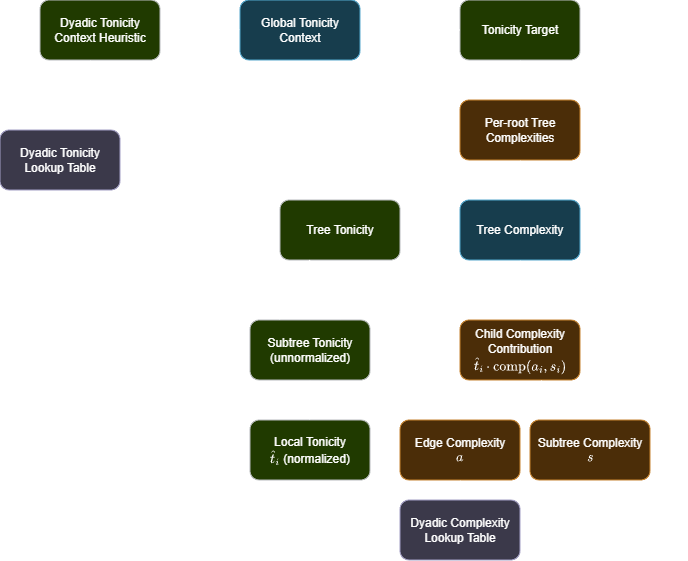

The main issue is that the **dyadic tonicity is not part of the recursion**, it is only used to initialize the model. Recall that the tonicity score between two notes is the only source of asymmetry/non-duality in this model &mdash; this asymmetry was the entire motivation for introducing the concept of tonicity in [Base case: Dyadic tonicity](#base-case-dyadic-tonicity).

Since dyadic tonicity is not part of the recursion and every other part of this model is symmetric (as in, harmonic duality of major/minor), over time the model will always converge to a dualistic model.


> **Exit plan**
>
> One possible solution is to not use a tree structure/recursion at all, and just directly combine dyadic tonicities with dyadic complexity scores.
>
> However, I wanted the gestalt property of substructures to be modelled, so I could not do away with the tree-based interpretation.

To solve this, we have to find a way to **incorporate dyadic/edge tonicities in the recursion**.

My first instinct is to look at the weak spots of this model to find where dyadic tonicities can be added:

1. The $\text{comp}(a, s)$ function for combining edge and subtree complexities.

   - This function was heuristically made to combine the edge and subtree complexity scores, but the arbitrary precedence of edge complexity over subtree complexity just to get better triadic tonicity results was suspicious.

2. The subtree tonicity score is solely computed as the sum of global tonicities of all nodes in the subtree, there is not enough interaction between the subtree tonicity and the rest of the model.

   - The analogue of subtree tonicity is the subtree complexity. Notice that subtree complexity is directly affected by three information sources at each subtree: edge complexity, subtree complexities of its children, and local tonicity scores obtained from subtree tonicity.
   - Compare that to the active information sources that affect subtree tonicity: subtree tonicities of its children and global tonicity context. There is a very indirect recursion from the aggregation of tree complexities that affects the global tonicity context which in turn affects the subtree tonicities, but this only happens once every update step, rather than at every node traversal.

3. The meaning of "tonicity" is not consistently interpreted. For individual notes, tonicity is the probability of that note being interpreted as the root, but subtree tonicity is defined as the sum of global tonicities, but it doesn't make sense for an entire subtree to "be a root". When interpreted mathematically, the sum of global tonicities of notes in a subtree is equal to the probability of the root being contained in that subtree. The current flawed algorithm uses "the probability of the root being contained in a subtree" $\hat{t}_i$ to weight the complexity contribution of that subtree $\text{comp} (a_i, s_i)$.

### Decoupling likelihood, tonicity, and complexity

To glean some remedies from the first weak spot, recall that the rationale for weighting edge complexity more than subtree complexity was to discourage preferring interpretation trees whose roots are "dissonant offenders", i.e., notes that have high dyadic complexity with respect to many other notes in the voicing. E.g., consider the C-E-G triad interpreted two ways:

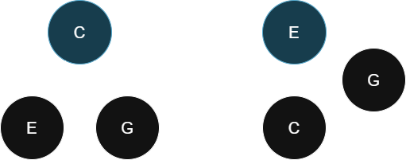

The first interpretation (left) will have the same complexity score whether we penalize edges or subtrees more, since both E and G are leaf nodes.

The second interpretation (right), however, will have a much higher complexity score if we give edge complexity precedence, since the first edge is `E->G` (m3) which is the highest-complexity dyad out of the three options (P5, M3, m3). Naively, I thought this was good since I did not want E to be considered a root. However, this also means that even though a subtree contains many more edges than a single edge, that single edge's complexity can override the entire subtree's complexity, which is not desirable.

Instead, if we give subtree complexity more precedence, we encounter a new problem: the second interpretation will have a lower complexity score, even lower than the first interpretation, since the subtree `G->C` is the lowest complexity dyad (P5) out of all three options, which cancels out the high edge complexity of `E->G`.

Neither of these options help to directly increase the likelihood of the first (left) interpretation without collaterally affecting other interpretations.

The underlying problem is that this model directly conflates complexity, root tonicity, and likelihood of trees. If we didn't have this direct relationship, there would be no need to fine-tune the complexity scores of each tree structure to yield the "correct" choice of root.


> [!NOTE]
> Remember back in [Generalizing: Polyadic tonicity evolving with time](#generalizing-polyadic-tonicity-evolving-with-time) where I mentioned to ignore the modelling of likelihood of interpretation trees? This is now that bad decision coming back to bite.

> [!NOTE]
> [Likelihood](https://en.wikipedia.org/wiki/Likelihood_function) is a statistical term that refers to the probability of observing some data given a model. However, I am not using this word in that rigorous sense, I am just using it as a keyword that refers to "how likely a listener is to perceive this interpretation tree as the model of the chord voicing they heard".

The fix is to decouple likelihood from complexity. Let's forget the current model, and now consider how to recursively compute both the likelihood and complexity of trees. **Once we know how to compute the likelihood of a tree, then the tonicity of a note is simply equal to the sum of the likelihood of trees with that note as its root.**

Now we have to rework the meaning of subtrees, edges, nodes, tonicity, and complexity in the interpretation tree to include the measure of likelihood. The table below summarizes which terminology applies to which part of the tree:

| Component | Term | Definition |
|-----------|-------|------------|
| Node | Global tonicity | Contextual distribution of the probability that node is interpreted as root |
| Edge | Dyadic complexity | Undirected complexity of the dyad formed by the edge
| Edge | Dyadic tonicity alignment | Higher if parent is "more tonic" than child in a vacuum |
| Subtree | Subtree complexity | Weighted complexity of aggregate of child's subtree complexity & edge complexity |
| Subtree | Subtree likelihood | Likelihood of listener choosing to perceive the chord as this tree |
| Subtree | Subtree tonicity | Sum of global tonicities of all nodes in subtree = probability that perceived root is contained in subtree |
| Subtree | Edge count | Number of edges in subtree (number of nodes - 1) |

Listing ideal behaviours of each component in the new model:

1. A subtree with high complexity, regardless of whether the edge that connects it to the parent is simple or complex, should **both**:
   1. Contribute more to overall complexity of the tree (compared to simple subtrees), and
   2. Decrease the **overall likelihood** of this interpretation tree being a model of how the listener perceives the chord, since the main purpose of having the subtree is to identify consonant substructures.
   3. Vice versa for low-complexity subtrees.
2. An edge with high dyadic complexity, regardless of the subtree (if any) it connects to, should:
   1. Contribute more to overall complexity of the subtree (compared to simple edges), but
   2. It **should not** directly affect the overall likelihood of the listener perceiving this interpretation tree, as some chords/subtrees only have dissonant interpretations. Once the complexity of the entire subtree is computed, that complexity of the whole subtree/tree can be used to determine the likelihood of the subtree/root.
   3. Vice versa for low-complexity edges.
3. An edge with high dyadic tonicity alignment, i.e., the dyadic tonicity of parent-child shows higher tonicity for the parent, should:
   1. Increase the overall likelihood of this interpretation tree.
   2. Should not affect complexity.
   3. Vice versa for low dyadic tonicity alignment.
4. A node with high global tonicity alignment, i.e., parent with high global tonicity, or child with low global tonicity, should:
   1. Increase the overall likelihood of this interpretation tree.
   2. Vice versa for low global tonicity parents or high global tonicity children.
5. To obtain the complexity contribution from each child node, we consider a function of:
   1. The subtree complexity at that child (from 1. and 5.)
   2. The dyadic complexity of the edge connecting the parent to the child (from 2.)
   3. The subtree tonicity (the total probability of the subtree containing the root, which for now we conflate with the "strength" or "tonal gravity" of the subtree)
   4. The number of nodes in the subtree (to fairly compare between subtrees of different sizes and leaf children)
   5. We **do not** include the likelihood of the subtree (to discount the complexity contribution of unlikely subtrees), as that information is already propagated down to the root which weights the final dissonance contribution of the full tree.
   6. Unlike in the flawed model, the $\text{comp}(a_i, s_i)$ function which weights edge complexity over subtree complexity is now parametrized to allow control over whether and how much edge complexity should affect overall subtree complexity compared to subtree complexity. Ideally, edge complexity should still have more effect than subtree complexity, since edges close to the root of the interpretation tree are the first to be perceived (the model assumes that the pre-order traversal of the interpretation tree represents the order of note perception).
6. To obtain the likelihood contribution from each child node, we consider a function of:
   1. The likelihood of the subtree at that child (from 1. and 6.)
   2. The dyadic tonicity alignment of the edge connecting the parent to the child (from 3.)
   3. The global tonicity of the parent and child nodes. (from 4.)

This automatically solves the second weak spot: the subtree tonicity now has a clear purpose, and cross-interaction between dyadic tonicity and complexity is established through the likelihood computation.

The third weak spot is also resolved since tonicity is now consistently defined as the probability of being root for individual notes, and the probability of containing the root for subtrees. Tonicity is no longer conflated with likelihood, which is a separate metric.

### Dyadic complexity model update: Widening major vs. minor complexity score gap

In the first version, I used the dyadic roughness/complexity scoring system as per [Base case: Dyadic complexity](#base-case-dyadic-complexity):


One of the key goals was to ensure major and minor triads did not have the same dissonance score, which is a common problem amongst dyad-based complexity/dissonance models. I've ascertained that minor and major triads are treated differently by this v2 model, but the gap between minor and major triad complexity in various inversions/voicings was abysmally small ($\approxeq 0.01$), relative to the gap between the perfect fifth and fourth dyads. Initially I thought that there was an issue with the polyadic algorithm itself, but I later realized that the bottleneck was not the polyadic algorithm but the original dyadic base case we started with.

The first issue I realized was that, since I was performing most of the tests in 12edo, a lot of the dyadic roughness and tonicity values were not as distinct as I wanted, as the 12edo intervals stray far from the regions of consonance in the roughness curve in the image above, especially for the 5-limit major/minor thirds.

The second issue was that the smoothing model that I used (computing Sethares' roughness every 0.05 cents and averaging each 1-cent bucket) had two flaws:

1. It did not model how human interval perception has larger tolerances for simpler intervals
2. The uniform average of each 1-cent bucket did not do sufficient smoothing and the roughness curve had very tight tolerances for what it considered "close" to a consonant JI interval.

To solve these issues, I took a $\pm 20$-cent sliding window weighted average of the half-cent resolution roughness curves (which were uniformly averaged from the 1/20th-cent resolution roughness curves). Each 1/2 cent in the sliding window was weighted by a Gaussian kernel with $\sigma = 15$, multiplied by $\exp(-\text{roughness} \cdot 4)$ to increase the weight of lower-roughness intervals.

I also increased the smoothing on the dyadic tonicity curve so that dyadic tonicities more closely resemble human perception for tolerance of detunings around consonant JI intervals.

The resulting dyadic roughness and tonicity curves are as follows:

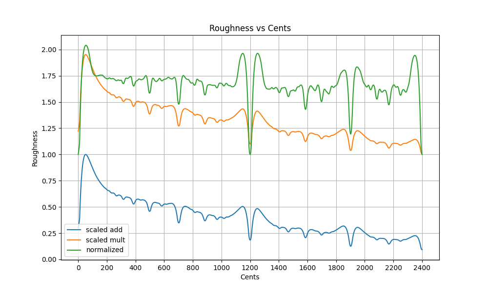

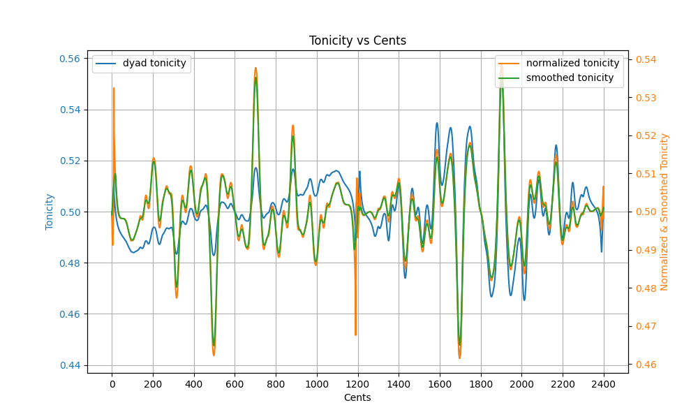

The final dyadic roughness calculation for intervals uses the blue line (scaled add) in Roughness vs Cents, while reducing the per-octave dropoff to 0.86 per octave instead of 0.5 as pictured in the graph (as in, every octave the roughness halves). Additionally, lower interval limit was emulated on a per-dyad basis in `lower_interval_limit_penalty()` in [polyadic.rs](https://github.com/euwbah/dissonance-wasm/blob/master/src/polyadic.rs).

The normalized dyadic roughness (green) in Roughness vs Cents is used for computing the raw dyad tonicity (blue line in Tonicity vs Cents). The final dyadic tonicity scores are retrieved from the smoothed tonicity (green line in Tonicity vs Cents).

The full 9 octaves of values can be found in [sethares_roughness_31_5_0.95.csv](https://github.com/euwbah/dissonance-wasm/blob/master/sethares_roughness_31_5_0.95.csv) and [dyad_tonicity_19_5_0.95.csv](https://github.com/euwbah/dissonance-wasm/blob/master/dyad_tonicity_19_5_0.95.csv).


### Information flow of revised model

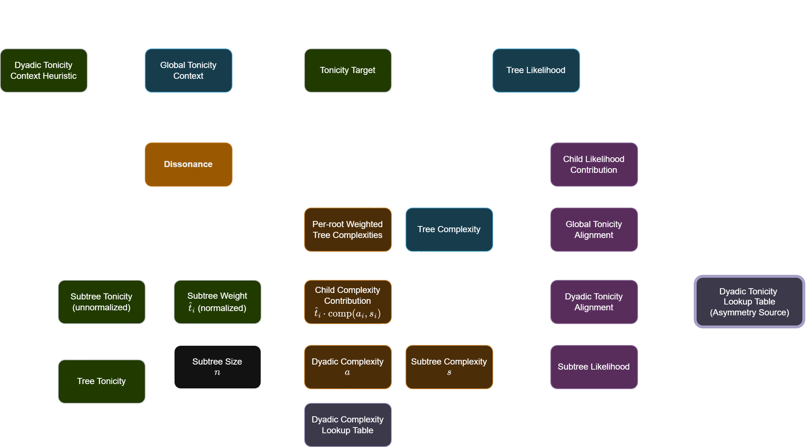

### Computing values in revised model

The adjustable parameters below can be found and modified near the top of [polyadic.rs](https://github.com/euwbah/dissonance-wasm/blob/master/src/polyadic.rs), which implements this algorithm.

#### Computing tree/subtree complexity

**Tree/subtree complexity** of the subtree at node $j$ is implemented in `compute_child_subtree_complexity_contribution()` and `compute_child_leaf_complexity_contribution()`. It is recursively computed in terms of the $i$-th child's subtree weight $\hat{t}_i$,dyadic complexity between its child and itself $a_i$, and child's subtree complexity $s_i$ using:

$$
c_j = \begin{cases}
    \sum_{i \in \text{children}(j)} \hat{t}_i \cdot \text{comp}_k (a_i, s_i), & \text{if } i \text{ has children} \\
    \sum_{i \in \text{children}(j)} \hat{t}_i \cdot a_i, & \text{if } i \text{ is a leaf}
\end{cases}
$$

The function $\text{comp}_k (a_i, s_i)$ is updated from the prior model to include a parameter $k =$ `EDGE_OVER_SUBTREE_COMPLEXITY_BIAS` $\in [-1, 1]$ which controls how much more edge complexity should affect overall subtree complexity compared to subtree complexity. A value of $k=1$ means edge complexity has more precedence, i.e., `comp(1, 0) = 0.75` but `comp(0, 1) = 0.25`, and $k=-1$ means subtree complexity has more precedence. Since we model interpretation trees as the structure of how the listener perceives the chord from the root to leaves (in pre-order traversal where each node's children are sorted in ascending pitch order), edges closer to the root should have more effect on overall complexity, so `EDGE_OVER_SUBTREE_COMPLEXITY_BIAS` is initially set to 0.65:

$$
\text{comp}_k (a, s) = \frac{a + s}{2} \cdot \left(1 + \frac{k}{2} (a - s)\right).
$$

This [desmos graph](https://www.desmos.com/calculator/jho2nihmwl) visualizes how $\text{comp}_k (a, s)$ behaves for different values of $k$.

At each subtree, the complexity is a value between $[0, 1]$ which represents the minimum and maximum possible complexity attainable. The distribution of complexity scores for all $N$-note chords is currently unknown and needs more testing.

#### Computing subtree weight

**Subtree weight** of the $i$-th child of $j$ is computed in `compute_subtree_weights()` as such: For each child node, the child's subtree tonicity (sum of its nodes' tonicities) is computed. Each child has a local tonicity weight according to its subtree tonicity which is given by the softmax over all children's subtree tonicities, with temperature (inverse opinionatedness) parameter initially set to `LOCAL_TONICITY_TEMP = 0.7`. Let $t'_i$ denote the softmax local tonicities of the $i$-th child, such that $\sum_i t'_i = 1$.

The subtree weight now balances the softmax local tonicities $t'_i$ with the proportion of nodes in the subtree $n_i$ at the $i$-th child, so that large subtrees with the same subtree tonicity as small subtrees will still have higher weight. The importance of local tonicity vs. subtree size is controlled by `TONICITY_BIAS` initially set to 0.6:

$$
\hat{t}_i = \texttt{TONICITY\_BIAS} \cdot t'_i + (1 - \texttt{TONICITY\_BIAS}) \cdot \frac{n_i}{\sum_{k \in \text{children}(j)} n_k}.
$$

where $\sum_k n_k$ is the number of nodes amongst all child subtrees of $j$.

#### Computing tree/subtree likelihood

**Tree/subtree likelihood** of the subtree at node $j$ is computed in `compute_child_likelihood_contribution()`. It is done recursively in terms of subtree likelihoods of its children $\lambda_i$ inversely weighted by child subtree complexity $c_i$, dyadic tonicity alignment of the edge from $j$ to each child $i$, and global tonicities of node $j$ and each child $i$, and is computed by the geometric mean of the likelihood contributions over each child node/subtree:

$$
\lambda_j = \left(\prod_{i \in \text{children}(j)} \kappa(\lambda_i, c_i) \cdot \text{dyad-align} (j \to i) \cdot \text{global-align} (j \to i) \right)^{1 / \left| \text{children}(j) \right|}.
$$

This likelihood is a multiplicative score in $(0, \infty)$ where 1.0 is neutral (neither increasing nor decreasing likelihood).

The first component $\kappa (\lambda_i, c_i)$ captures the likelihood of the child subtree scaled inversely by how complex it is. Intuitively, the more complex a subtree, the less its likelihood should affect the likelihood of the full interpretation tree, which is modelled by raising the child subtree's likelihood to the power of a term $1 + k \cdot (0.5 - c_i)$ where $k =$ `COMPLEXITY_LIKELIHOOD_SCALING` which increases the weight of the child subtree's likelihood if the complexity is low. Then, two bias terms are multiplied: one that increases the likelihood by up to $2^b = 2^\texttt{COMPLEXITY\_LIKELIHOOD\_BIAS}$ times if the subtree complexity is low, and the other parameter $p =$ `DEEP_TREE_LIKELIHOOD_PENALTY` which decreases the overall likelihood of deeply nested interpretation trees by scaling likelihood of each child subtree by $2^{-p}$:

$$
\kappa (\lambda_i, c_i) =
\begin{cases}
    1 & \text{if } i \text{-th child is a leaf}, \\
    \lambda_i^{1 + k \cdot (0.5 - c_i)} \cdot 2^{b \cdot (0.5 - c_i) - p} & \text{otherwise},
\end{cases}
$$
Where `COMPLEXITY_LIKELIHOOD_SCALING` is initially set to 2.0, `COMPLEXITY_LIKELIHOOD_BIAS` to 1.5 and `DEEP_TREE_LIKELIHOOD_PENALTY` set to

The second component $\text{dyad-align} (j \to i)$ is the dyadic alignment of the edge from parent $j$ to child $i$, computed from the dyadic tonicity $t_{j \to i} \in [0, 1]$ which represents how tonic the parent is when the parent and child notes are played in a vacuum. This value is retrieved from the lookup table as obtained in [Base case: Dyadic tonicity](#base-case-dyadic-tonicity). Contribution of dyadic alignment is scaled by `DYADIC_TONICITY_LIKELIHOOD_SCALING` initially set to 4.0:

$$
\text{dyad-align} (j \to i) = \texttt{DYADIC\_TONICITY\_LIKELIHOOD\_SCALING}^{t_{j \to i} - 0.5}.
$$
Note that the conservative range of $t_{j \to i} \in (0.44, 0.56)$ and extremely low variance (0.001) of the dyadic complexity score means that we probably have to increase the scaling of this component later.

Finally, the third component $\text{global-align} (j \to i)$ is the global tonicity alignment of parent $j$ and child $i$, computed the logistic function applied to the ratio between their global tonicities $t_j / t_i$. This contribution is scaled by `GLOBAL_TONICITY_LIKELIHOOD_SCALING` initially set to 4.0:

$$
    L(j \to i) = \frac{1}{1 + \exp(1 - \text{clamp}(t_j/t_i, \frac{1}{50}, 50))}, \\
    \text{global-align} (j \to i) = \texttt{GLOBAL\_TONICITY\_LIKELIHOOD\_SCALING}^{L(j \to i) - 0.5}.
$$

#### Computing final dissonance score

The dissonance score is computed by the weighted sum of complexities of each interpretation tree, weighted twice, first by the aggregated softmax likelihoods of interpretation trees, and then by the probability of perceiving each root according to the updated global tonicity context (after updating tonicities towards the target). A softmax with low temperature `TONICITY_CONTEXT_TEMPERATURE_DISS` is applied on the global tonicity context to model how a listener would rather perceive one root at a time, rather than multiple roots simultaneously.

$$
\text{diss} = \sum_{r \in \text{roots}} \hat{t}_r \cdot \frac{\sum_{t \in \text{trees} (r)} c_t \cdot \ell_t}{\sum_{t \in \text{trees} (r)} \ell_t},
$$
Where $\hat{t}_r$ is the softmax of global tonicity context of note $r$, `trees(r)` is the set of interpretation trees rooted at note $r$, $c_t$ is the complexity of tree $t$, $\ell_t$ is the softmax likelihood of tree $t$ amongst all interpretation trees (with temperature `TONICITY_CONTEXT_TEMPERATURE_TARGET`), and $\sum_{t \in \text{trees}(r)} \ell_t$ is the sum of all softmax tree likelihoods rooted at note $r$.

This double-weighting ensures that both the most likely interpretation trees for each root, and trees with the most likely perceived root will have a stronger influence on the final dissonance score.

#### Computing tonicity target

The target global tonicities are computed by the softmax of likelihoods of each interpretation tree, with temperature `TONICITY_CONTEXT_TEMPERATURE_TARGET`.

### Algorithm v2 results (pre-optimization/tuning)

I have run some initial tests with

```sh
cargo test polyadic::tests::test_graph_diss -- --exact --no-capture > test_graph_diss.txt
cargo test polyadic::tests::test_sanity_metrics -- --exact --no-capture > test_sanity1.txt
```

Using the following parameters:

```rust
const HEURISTIC_DYAD_TONICITY_TEMP: f64 = 0.8;
const LOCAL_TONICITY_TEMP: f64 = 0.7;
const NEW_CANDIDATE_TONICITY_RATIO: f64 = 0.2;
const EDGE_OVER_SUBTREE_COMPLEXITY_BIAS: f64 = 1.0;
const TONICITY_BIAS: f64 = 0.6;
const COMPLEXITY_LIKELIHOOD_BIAS: f64 = 1.5;
const COMPLEXITY_LIKELIHOOD_SCALING: f64 = 1.0;
const DEEP_TREE_LIKELIHOOD_PENALTY: f64 = 2.2;
const GLOBAL_TONICITY_LIKELIHOOD_SCALING: f64 = (2u128 << 12) as f64;
const DYADIC_TONICITY_LIKELIHOOD_SCALING: f64 = (2u128 << 38) as f64;
const LOW_NOTE_ROOT_LIKELIHOOD_SCALING: f64 = 1.04;
const TONICITY_CONTEXT_TEMPERATURE_TARGET: f64 = 0.5;
const TONICITY_CONTEXT_TEMPERATURE_DISS: f64 = 0.1;
```

> [!NOTE]
>
> The full results from this initial test can be found in [paper/test_graph_diss.txt](https://github.com/euwbah/dissonance-wasm/blob/master/paper/test_graph_diss.txt) and [paper/test_sanity1.txt](https://github.com/euwbah/dissonance-wasm/blob/master/paper/test_sanity1.txt).
>
> The test function `graph_diss()` has adjustable parameters that control how much information is displayed. Currently, only the top 2 likelihood and lowest 2 complexity trees are displayed per root, and the overall top 10 dissonance contributing trees are displayed for each chord voicing.
>
> I have only kept the important metrics in the examples below, so I recommend exploring the test results or running your own tests :)

First, the sanity metrics checks the basic requirements of the algorithm:

```txt
=============== SANITY METRICS ================

        min - maj: 0.019264974173406557
 min - maj scaled: 0.42895460445340416
     tritone - p4: 0.06729656027850978
          p4 - p5: 0.10898553770569647
  lower intv. lim: 0.13554630263072426
  P5 tonicity gap: 0.559810129798844
 targ. C conf maj: 0.49758471909992175
 targ. C conf min: 0.45966830181957113
```

- `min - maj`: The absolute dissonance score gap between the minor and major triad in root position.
  - This value means that a minor triad scores 0.019 higher dissonance than a major triad, which is a good sign that the model can distinguish between major and minor triads.

- `min - maj scaled`: The ratio between the min-maj triad dissonance gap and the gap between the dissonance score gap between minor 3rd and major 3rd dyads.
  - Since the polyadic model uses dyadic roughness as the base source of complexity, a value of 1 here would mean that the polyadic model is maximally efficient at translating the difference between a minor and major dyad into the difference between the minor and major triads. A score of 0.43 here means that it is able to capture 43% of that difference, which I am satisfied with.

- `tritone - p4`: The dissonance of a tritone minus the dissonance of a perfect fourth.
  - There was a bug when developing this revised model where the P4 scored higher dissonance than the tritone, which is obviously wrong. This bug turned out to be a math mistake in the double-weighted final complexity calculation, which has now been fixed. A positive value here is a good sign.

- `p4 - p5`: The dissonance of a perfect fourth minus the dissonance of a perfect fifth. With certain badly-set parameters, this value could be too small or too large caused by exaggerated effects of global tonicity on the complexity scoring. A value that is close to the difference between P4 and P5 in the raw (scaled add) dyadic complexity in the Roughness vs Cents graph above is a good sign.

- `lower intv. lim`: The difference in dissonance score between the same A major chord played at A7 and played at A1. This value should be positive, and higher scores denote a larger effect of the lower interval limit penalty on the overall dissonance score. This value is very subjective, so it should be tuned on a per-use-case basis.

- `P5 tonicity gap`: The difference between the target tonicity of the root and fifth of the perfect fifth dyad. A higher value means that the model is more confident that the root is more tonic than the fifth in a perfect fifth dyad. Amongst all dyadic options, the P5 has the largest dyadic tonicity score, so this value gives a sort of upper limit on the maximum confidence ($0.5 + 0.55981 / 2 \approx 0.7799$) that this model can have that any one particular note is tonic given the current parameters.

- `targ. C conf maj`: The target tonicity of C in the C major triad. A higher value means that the model is more confident that C is the root of the C major triad.

- `targ. C conf min`: The target tonicity of C in the C minor triad. A higher value means that the model is more confident that C is the root of the C minor triad.
  - In the old version of this project (before this article was written), the model would say Eb is the root of the C minor triad. This is not exactly wrong (because relative major), but according to intuition, in a vacuum, the perfect fifth C-G's likelihood contribution to C as root should outweigh the major third between Eb and G, which this model is now able to capture.

## Practical considerations

### Adding & removing notes

The [lattice visualizer](https://github.com/euwbah/n-edo-lattice-visualiser) is a real-time visualization for this complexity & tonicity algorithm, with the goal of detempering MIDI input played in any equal te``mperament in real-time.

Unlike other models of harmonic analysis that rely on only notes that are currently being sounded/played, I acknowledge the important role of auditory memory in harmonic perception. Thus, the visualizer also models a short-term memory of notes that are played, where the strength/persistence of those notes increase with tonicity, volume (midi velocity), repetition, recency, and other supporting notes (octaves and fifths) based on the western cultural biases.

The exact implementation is beyond the scope of this article, but in a nutshell, a maximum of 7 notes in the contextual memory is maintained (if octaves of a note is played, only the lowest currently sounded octave is considered, or otherwise if the note is no longer sounded, the most recent octave is considered). Each note has a persistence score such that when it gets to 0, the note is removed from memory. The persistence of each note is computed using its tonicity and also its **dissonance contribution** (i.e., the difference of complexity when this note is present vs absent). The persistence score also determines which note is the first to go when the max number of notes is exceeded. Ideally, there should be no maximum limit on the number of notes, however, this was necessary to keep the computation manageable for real-time performance.

When a new note is played that is not already in the pitch memory model (or an octave-equivalent), the visualizer goes through a pre-computed list of possible JI ratio interpretations (because the purpose of the visualizer is to perform real-time detemperament). These various interpretations are sent as candidate frequencies to this algorithm, where each candidate is assessed as the $(N+1)$-th note. The new candidate will be initialized with an initial tonicity score that scales proportionately to the average-of-dyads heuristic in [First step: Major vs minor triads](#first-step-major-vs-minor-triads).

Specifically, the tonicity score of the new candidate will be initialized to the tonicity score in the dyadic heuristic. Then, the other existing notes' tonicities in the harmonic context will be re-normalized linearly to sum to $1 - t_{\text{new}}$.

> [!IMPORTANT]
>
> **Question**: How to improve the initial tonicity assignment of new candidates, especially so that the existing tonicities of notes are not too affected?
>
> Besides initializing $t_\text{new}$ as the heuristic value, I have also tried initializing it to some small value like 0.001. Both seemed to end up with similar results in my experiments playing around with the visualizer.

Then, the "best candidate" will be picked, which is scored on a heuristic that depends on its dissonance contribution, JI complexity relative to the current tonal center/harmonic centroid in 5D space of 11-limit JI, and its tonicity, in descending order of precedence. The selected candidate is then added to the pitch memory model.

### Optimizations

I would be happy if the algorithm could run as is. The problem now is that the computational complexity explodes exponentially with the number of notes. If I have 7 notes in the pitch memory model and I am playing one new note, the algorithm has to consider all possible interpretation trees with 8 notes, multiplied by the number of candidate frequencies for the new note (which can be up to 20). This gives a maximal complexity of performing a DFS on $8^7 \cdot 20 = 41,943,040$ trees per update tick.

> This complexity is already an improvement over the previous version of the algorithm in [polyadic-old.rs](https://github.com/euwbah/dissonance-wasm/blob/master/src/polyadic-old.rs) that grew factorially with the number of notes, the previous algorithm would have to consider $8! \cdot 7! \cdot 20 = 4,064,256,000$ trees for a full search.

The full tree generation code is found in `gen_sts()` of [tree_gen.rs](https://github.com/euwbah/dissonance-wasm/blob/master/src/tree_gen.rs), where I used a root-down approach with a combinatorial choosing function to enumerate possible children for each node. It turns out that generating the set of all spanning trees under the optimizing constraints below is not a trivial algorithm.

The following heuristic optimizations are currently implemented to reduce the interpretation tree search space while still holding true to my musical intuition. Note that these optimizations do not require computing any complexity or tonicity values, but only depend on the structure of the interpretation tree itself.

#### Max tree depth

Any path of from the root to leaf in an interpretation tree represents a chain of relative references the listener will interpret the notes as.

For example, in the depth-3 tree below:

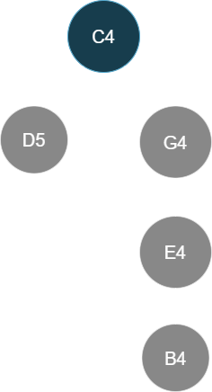

The path from C4 to B4 implies an interpretation where the listener chooses to hear B4 as the fifth of E4 as the minor third below G4 as the fifth of C4.

Intuitively, there would be no reason for a listener to interpret this chord in such a convoluted way. Instead, something more intuitive would follow the natural construction of Cmaj9 where fifth-extensions are stacked on the root and third, which yields a depth-2 tree:

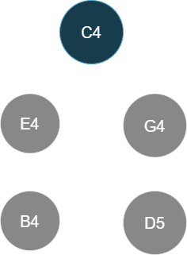

There are some edge cases of extremely complex large chords where deep interpretation trees are intuitive, but (to my subjective intuition), most interpretation trees are within a depth of 3 (i.e., where the root is depth 0, the deepest leaf node is the great-grandchild of the root).

This optimization is parametrized by the `max_depth` parameter of `gen_sts()`.

#### Max siblings

Another intuitive optimization is to limit the number of children (or equivalently, siblings) each node can have. Take for example the following tree:

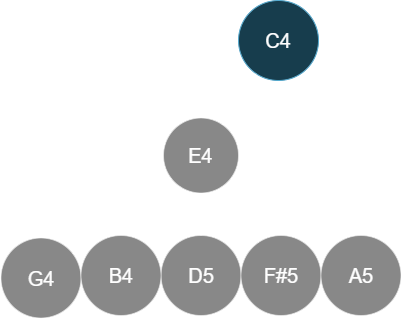

It is unlikely for a listener to interpret 5 notes all with respect to a non-root E4. In this case we have a Cmaj13#11 chord represented as a tertian stack, so the following interpretations would be more intuitive for me:

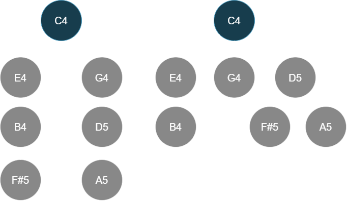

I find that 3 siblings is a reasonable limit for most interpretations.

This optimization is parametrized by the `max_siblings` parameter of `gen_sts()`.

#### Pre-order traversal inversions

There is an intuitive ordering of trees that decided whether a tree "made sense" or not, even without evaluating complexity or tonicity. This took some time for me to realize and formalize.

Compare the following two interpretations of the same voicing of the chord Cmaj13#11:

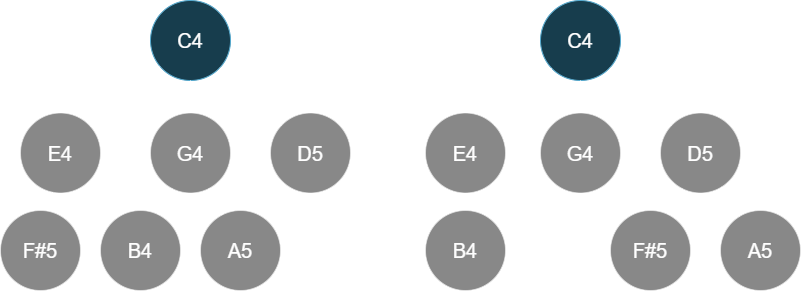

Both trees have the same structure and the same root, the root has three children, one with no children, one with one child, and one with two children; both trees' nodes' children are sorted in increasing pitch order visually from left to right, and both trees have relatively consonant intervals between parent and child nodes.

However, one tree "made more sense". At least for me, that was the right tree.

The notes of the voicing, in order of ascending pitch, is C4 E4 G4 B4 D5 F#5 A5, which is the standard tertian stack for Cmaj13#11.

However, the left three feels "all over the place". My intuition told me it had something to do with how notes want to be perceived in order of bottom to top. I.e., lower notes are more likely seen as the parents of higher notes (because we naturally hear higher notes relative to lower notes).

Initially I thought that this was only due to the tertian nature of the voicing, so I tried this intuition experiment with another common voicing: C4 C#4 E4 G4 A4 C5, which is relatively common closed voicing for C13b9:

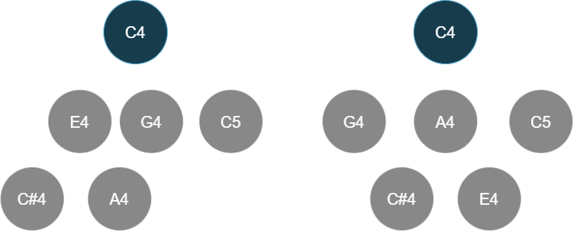

There is only one difference between the two trees: the position of E4 and A4 are swapped (and the children of C4 are sorted in ascending pitch as usual). Both trees still preserve the A major substructure of the voicing as a subtree.

Yet, the left tree _feels_ more slightly more coherent than the right tree.

I realized that the [pre-order traversal](https://www.geeksforgeeks.org/dsa/preorder-traversal-of-binary-tree/) of the tree closely matches how a human would perceive the interpretation organized in a tree structure.

In the left tree of the previous Cmaj13#11 example, the pre-order traversal is C4, E4, F#5, G4, B4, A5, D5. The right tree for Cmaj13#11 has pre-order traversal C4, E4, B4, G4, D5, F#5, A5.

In music terminology, the left tree models the interpretation of that Cmaj13#11 voicing as:

- C4 is the root
- E4 is the 3 of the root
- F#5 is the 9 of E4
- G4 is the 5 of the root
- B4 is the 3 of G4
- A5 is the 9 of G4
- D5 is the 9 of the root

The right tree for Cmaj13#11 models the interpretation as:

- C4 is the root
- E4 is the 3 of the root
- B4 is the 5 of E4
- G4 is the 5 of the root
- D5 is the 9 of the root
- F#5 is the 3 of D5
- A5 is the 5 of D5

**Claim 1**: Pre-order traversal of the tree gives an order of precedence of notes. Notice how if we perceive sibling nodes in ascending pitch order, we end up with a natural order of pitch perception in pre-order traversal. Of course, the biggest counter-example would be the fact that the lowest and highest pitches are perceived first in practice. However, the intuition of constructing how notes relate to each other still holds when hearing in terms of vertical harmony.

**Claim 2**: The intuitive "weirdness" of tree comes from inversions of the pre-order traversal when compared to the pitch-order of the voicing. Given an original ordering of notes $\left(N_i\right)_{i=1}^N$ from low to high, the number of **inversions** is the number of pairs of notes $(N_i, N_j)$ such that $i < j$ but $N_i$ appears after $N_j$ in the pre-order traversal of the tree.

> [!IMPORTANT]
>
> These claims are merely hypotheses. They come from testing my intuition on a few examples, but I would like to know if there are any more rigorous ways to justify these, or if there are any counter-examples.

Going back to the Cmaj13#11 example, the left tree's pre-order (C4, E4, F#5, G4, B4, A5, D5) has 4 inversions when compared to pitch-order:

1. (F#5, G4)
2. (F#5, B4)
3. (F#5, D5)
4. (A5, D5)

Whereas, the right tree's pre-order (C4, E4, B4, G4, D5, F#5, A5) has only 1 inversion:

1. (B4, G4)

In the second example with the closed C13b9 chord, the left tree's pre-order (C4, E4, C#4, A4, G4, C5) has 2 inversions:

1. (E4, C#4)
2. (A4, G4)

But the right tree's pre-order (C4, G4, A4, C#4, E4, C5) has 4 inversions:

1. (G4, C#4)
2. (G4, E4)
3. (A4, C#4)
4. (A4, E4)

Working through more of these examples gave me more confidence that limiting the number of inversions in pre-order traversal would help prune the search space of interpretation trees in a way that prioritizes more intuitive interpretations while still being very computationally efficient.

> [!NOTE]
>
> So far, all the previous examples use the bottom note as the root of the interpretation tree.
>
> If we consider inversions of the root of the tree (which is the first node in the pre-order traversal), then making the highest-pitched note a root of the tree will prune **all** trees for chords with more than `max_inversions` notes, since every note will be an inversion of at least the root.
>
> Since we require equal exploration of interpretation trees for each root (to compute the relative tonicities fairly based on per-root aggregated complexity scores), the inversion count should not consider the first node in the pre-order traversal, i.e., any inverted pairs involving the root note of the interpretation tree should not be counted.

As a guideline for the maximum number of inversions allowed, I considered the following interpretation of Cmaj13#11:

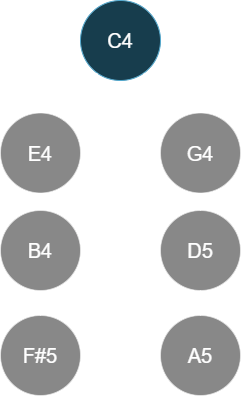

The pre-order traversal is C4, E4, B4, F#5, G4, D5, A5, which has 3 inversions:

1. (B4, G4)
2. (F#5, G4)
3. (F#5, D5)

Thus, I have used `max_inversions = 3` for spanning tree generation in `gen_sts()`.

#### Tree-generation pruning results

Before pruning, there are a total of $N^{N-1}$ unique spanning trees (counting unique choices of root). The tabulation shows the trees before and after pruning:

| Number of notes | Total trees before pruning | Total trees after pruning |
|-----------------|----------------------------|---------------------------|
| 2               | 2                          | 2                         |
| 3               | 9                          | 9                         |
| 4               | 64                         | 64                        |
| 5               | 625                        | 400                       |
| 6               | 7776                       | 1,842                     |
| 7               | 117,649                    | 6,972                     |
| 8               | 2,097,152                  | 23,104                    |

### Tree generation

The algorithm for enumerating all possible spanning trees within the above constraints was not as trivial as I thought. The full implementation is in [tree_gen.rs](https://github.com/euwbah/dissonance-wasm/blob/master/src/tree_gen.rs) in the `gen_sts()` function (where `gen_sts_recursive` is doing the bulk of the work).

Most spanning tree generation algorithms are leaf-up, i.e., starting from individual unconnected nodes and adding edges between them until all nodes are connected, checking that there are no cycles at each step. This is the main process for other spanning tree algos especially minimum spanning tree algorithms like Prim's and Kruskal's.

However, the leaf-up approach wouldn't work since the bulk of the pruning was done using the pre-order traversal of trees, which meant the root and lower-depth structure had to be fixed in order for early pruning to be done.

The main issue I faced with the root-down spanning tree generation was that there were many orders the same set of edges can be added in. E.g., for just 3 nodes, ordering $0 \to 1$ then $0 \to 2$ was regarded as a different tree than $0 \to 2$ then $0 \to 1$.

> In the first iteration of this algo where complexity scores were aggregated over all edge-orders of all spanning trees, this made sense to do, but it blew up the search space to beyond cosmic horrors, and the aggressive pruning that had to be done nullified the benefit of a tree-based algorithm.

To work around this, a queue of visited nodes had to be kept, which tracked which nodes have not yet been assigned children. Each visit to a node would comprise iterating over 0 to the max number of children (3), and for each iteration, forming all ascending-order sets of combinations of remaining unvisited nodes, and those will be assigned as children of each possible spanning tree. This happens until all nodes are visited or one of the constraints were broken.

The tree generation process takes around a few seconds and is done at loading time of the WASM module. Unlike the previous version of `graph-diss` which generated and pruned trees on the fly, I found it much more efficient this time to pre-compute trees first, then iterate over the pre-computed trees.

Pros of pre-computing trees: faster chord evaluation time. Cons: pruning metrics that depended on algo-specific values (e.g., complexity/likelihood of subtree) cannot be used for additional computation speedup, so the algorithm had to always iterate over entire pre-computed trees to work well.

### Memoization of DFS across interpretation trees

After pruning unlikely interpretation trees, there are still 23,104 trees to evaluate for 8-note chords. Each evaluation involves relatively expensive math computations (exponentials, floating point powers, multiplications) that has to be done over 7 edges per tree. This still adds up to a significant amount of complexity.

I realized that many smaller subtrees were repeated across different interpretation trees. Since the subtree's complexity and likelihood only depends on its nodes, edges, and dyadic roughness/tonicity values, which are all constant throughout the evaluation over all interpretation trees, I used a `u64 SubtreeKey` that uniquely identifies the subtree at each node of an interpretation tree, such that identical subtrees present in other interpretation trees have the same `SubtreeKey`. The `SubtreeKey` is generated efficiently while `TREES` are being pre-computed at startup.

Using `SubtreeKey`s, it was simple to implement memoization across computing all DFSs of all possible interpretation trees of an input chord.

A benchmark was run on 201 iterations of an 8-note tonicity context update.

Without memoization:

```txt
=============== SANITY METRICS ================

        min - maj: 0.012137977573400405
 min - maj scaled: 0.2702646430769437
     tritone - p4: 0.06729656027850967
          p4 - p5: 0.10898553770569636
  lower intv. lim: 0.13439663775500937
  P5 tonicity gap: 0.36668470251115715
 targ. C conf maj: 0.42407330546463173
 targ. C conf min: 0.40488250923758157
 existing vs cand: 0.011043448871907446

Benchmark time (201 8-note iters): 71.6581382 seconds
```

With memoization:

```txt
=============== SANITY METRICS ================

        min - maj: 0.012137977573400405
 min - maj scaled: 0.2702646430769437
     tritone - p4: 0.06729656027850967
          p4 - p5: 0.10898553770569636
  lower intv. lim: 0.13439663775500937
  P5 tonicity gap: 0.36668470251115715
 targ. C conf maj: 0.42407330546463173
 targ. C conf min: 0.40488250923758157
 existing vs cand: 0.011043448871907446

Benchmark time (201 8-note iters): 7.02643 seconds
```

After memoization, an 8-note tonicity update computation is performed in 35ms on average.

Note that all sanity metric scores were unaffected by the memoization.

The test `tree_gen::tests::test_subtree_key_uniqueness` ensures that all subtree keys were unique and well-formed.

```txt
Checking 2 trees with 2 nodes
Checking 9 trees with 3 nodes
Checking 64 trees with 4 nodes
Checking 400 trees with 5 nodes
Checking 1842 trees with 6 nodes
Checking 6972 trees with 7 nodes
Checking 23104 trees with 8 nodes

Subtree Key Statistics:
  Total unique keys: 41564
  Total unique subtrees: 41564
  Duplicate subtrees found (expected): 205411
  Collisions found (should be 0): 0
```

In total, only 41564 unique subtrees exist amongst all interpretation trees of up to 8 notes. This means that even though there are 23,104 unique interpretation trees for 8-note chords, totalling 184832 subtrees with repeats, the amount of (sub)tree-traversal computations that have to be done is limited to at most 41564, and the rest of the computations can be reused for an expected 4.4x speed up.

#### Memoizing with hot-swap candidate note

When testing candidate frequencies, only one node is assigned a different frequency & heuristic tonicity score. Hence, all subtrees that do not contain the candidate node can have their complexity and likelihood values reused from the previous candidate evaluation.

However, since the `SubtreeKey` indexes nodes based on ascending pitch, when the candidate frequency is changed, the ordering of nodes may change, which will cause the same subtree (with respect to note frequencies) show up as a different pre-computed `SubtreeKey`.

Hence, to allow for memoizing repeated calculations over different candidate notes, the pre-computed subtree keys had to be transformed via `polyadic::remap_subtree_key_to_og_indexing()`, which remaps subtree keys from ascending-pitch indexing to the indexing as per `freqs` passed to `graph_dissonance()`, and the candidate note is assigned to the last index.

The following test benchmarks the evolution of tonicity scores over 2000 iterations of updating the tonicities of 6 existing notes + 10 choices of candidate notes.

```txt
Bench iter 0: max tonicity cands idx: 3, tonicities: [0.16282858618467694, 0.16171231622828977, 0.16070448093331896, 0.16251010312599934, 0.1610516490358855, 0.16212473363546345, 0.02906813085636607]
Bench iter 25: max tonicity cands idx: 3, tonicities: [0.16550653749099487, 0.16119398261722512, 0.15929013638808595, 0.16253286081456372, 0.16000648157205105, 0.1615350775845235, 0.029934923532555703]
[omitted...]
Bench iter 450: max tonicity cands idx: 3, tonicities: [0.2621828224947987, 0.14391759268167806, 0.1330964841239457, 0.150881676576002, 0.1372819651756823, 0.14275591308535807, 0.02988354586253526]
Bench iter 475: max tonicity cands idx: 3, tonicities: [0.26989367046940826, 0.14241808444092754, 0.13144808174396425, 0.14948954952504634, 0.13568187509118296, 0.1411840793299383, 0.029884659399532346]
Benchmark time (500 7-note 10-candidate iters): 42.2349836 seconds
```

This sums up to around 84ms latency per new note played for testing 10 possible candidates.

Running this test again with 20 candidate notes each iteration:

```txt
Bench iter 0: max tonicity cands idx: 3, tonicities: [0.16282858618467694, 0.16171231622828977, 0.16070448093331896, 0.16251010312599934, 0.1610516490358855, 0.16212473363546345, 0.02906813085636607]
Bench iter 25: max tonicity cands idx: 3, tonicities: [0.16550653749099487, 0.16119398261722512, 0.15929013638808595, 0.16253286081456372, 0.16000648157205105, 0.1615350775845235, 0.029934923532555703]
[omitted...]
Bench iter 450: max tonicity cands idx: 3, tonicities: [0.2621828224947987, 0.14391759268167806, 0.1330964841239457, 0.150881676576002, 0.1372819651756823, 0.14275591308535807, 0.02988354586253526]
Bench iter 475: max tonicity cands idx: 3, tonicities: [0.26989367046940826, 0.14241808444092754, 0.13144808174396425, 0.14948954952504634, 0.13568187509118296, 0.1411840793299383, 0.029884659399532346]
Benchmark time (500 7-note 20-candidate iters): 73.4741993 seconds
```

For 20 candidates tested, the algorithm takes 147ms. We doubled the number of candidates, but the computation time only increased 75%, so the memoization across candidates is working well.

### Random tree sampling

Despite pruning and memoizations (and other optimizations not documented above), the algorithm takes an unacceptable amount of time to evaluate candidates on 7-note chords. The goal is sub-16ms delay per note played (where the algo has to decide which detemperament candidate to accept), and sub 5ms for 7-note tonicity updates. I decided to limit the maximum number of interpretation trees to evaluate, randomly sampling if the number of pre-computed trees exceeds the limit.

To find the optimal tradeoff between speed and accuracy, I ran the following benchmark in `polyadic::tests::bench_max_trees_deterioration`, which tests how different the result of N iterations of a 6-note + 10-candidates is while varying the `MAX_TREES` parameter. Note that when more iterations are run, the tonicity scores will have had more time to converge, so the lower the `MAX_TREES` setting, the more opinionated the tonicity scores will be. I am simply checking that the overall relative order of tonicity scores between the notes remain similar.

```txt
=== MAX_TREES = 18446744073709551615 ===
Benchmark time (142 6-note 10-candidate iters): 10.0458476 seconds. (14.13519353011089 iter/sec)
Max tonicity candidate: 3 (1700.00c). dissonance: 0.5377339992333904, tonicity: [0.18002023084205093, 0.15909286025132283, 0.15348772368029945, 0.1627118860164894, 0.15570388852891154, 0.1590510041130048, 0.029932406567921024]
Tonicity ranking of candidates: [0, 3, 1, 5, 4, 2, 6]


=== MAX_TREES = 20000 ===
Benchmark time (141 6-note 10-candidate iters): 10.0429054 seconds. (14.039761840234002 iter/sec)
Max tonicity candidate: 3 (1700.00c). dissonance: 0.5377248849132501, tonicity: [0.17988104210798891, 0.15911441671002594, 0.1535377764579727, 0.16271555544482016, 0.15574258658603835, 0.1590761689179511, 0.029932453775202872]
Tonicity ranking of candidates: [0, 3, 1, 5, 4, 2, 6]


=== MAX_TREES = 10000 ===
Benchmark time (143 6-note 10-candidate iters): 10.0016052 seconds. (14.29770493240425 iter/sec)
Max tonicity candidate: 3 (1700.00c). dissonance: 0.537743152470425, tonicity: [0.18015974449432864, 0.15907122728341352, 0.15343765623120897, 0.1627081070922976, 0.15566514757696204, 0.1590257585359457, 0.02993235878584358]
Tonicity ranking of candidates: [0, 3, 1, 5, 4, 2, 6]


=== MAX_TREES = 5000 ===
Benchmark time (191 6-note 10-candidate iters): 10.058831 seconds. (18.98828999115305 iter/sec)
Max tonicity candidate: 3 (1700.00c). dissonance: 0.5388464356796752, tonicity: [0.1873567890717728, 0.15795377500250674, 0.15083581733682216, 0.1624595756792588, 0.1538692797671602, 0.15759126795717118, 0.029933495185308075]
Tonicity ranking of candidates: [0, 3, 1, 5, 4, 2, 6]


=== MAX_TREES = 2500 ===
Benchmark time (361 6-note 10-candidate iters): 10.0012688 seconds. (36.095420213083365 iter/sec)
Max tonicity candidate: 3 (1700.00c). dissonance: 0.5399485224283189, tonicity: [0.22648247107949723, 0.15057484092925466, 0.1406736027833574, 0.15719734148624004, 0.14485563487531183, 0.150343861560041, 0.029872247286297768]
Tonicity ranking of candidates: [0, 3, 1, 5, 4, 2, 6]


=== MAX_TREES = 1000 ===
Benchmark time (500 6-note 10-candidate iters): 6.0210256 seconds. (83.04233086137351 iter/sec)
Max tonicity candidate: 3 (1700.00c). dissonance: 0.5469606224618418, tonicity: [0.27849698437218057, 0.14125546208177422, 0.12764070621062157, 0.14849983663283894, 0.1343111612998853, 0.13991080158169475, 0.029885047821004585]
Tonicity ranking of candidates: [0, 3, 1, 5, 4, 2, 6]


=== MAX_TREES = 500 ===
Benchmark time (500 6-note 10-candidate iters): 3.0749186 seconds. (162.60593044641897 iter/sec)
Max tonicity candidate: 3 (1700.00c). dissonance: 0.5483764583541461, tonicity: [0.26666365549106963, 0.14385612359553135, 0.13195171463371386, 0.15058836097702058, 0.13521524972866156, 0.14182190132065034, 0.029902994253352678]
Tonicity ranking of candidates: [0, 3, 1, 5, 4, 2, 6]


=== MAX_TREES = 250 ===
test polyadic::tests::bench_max_trees_deterioration has been running for over 60 seconds
Benchmark time (500 6-note 10-candidate iters): 1.7087951000000001 seconds. (292.6038352989191 iter/sec)
Max tonicity candidate: 3 (1700.00c). dissonance: 0.5517239352989377, tonicity: [0.271807987828909, 0.14435628360638428, 0.13119516691110594, 0.14745568700369144, 0.13376365921293318, 0.1415701896056374, 0.029851025831338623]
Tonicity ranking of candidates: [0, 3, 1, 5, 4, 2, 6]


=== MAX_TREES = 100 ===
Benchmark time (500 6-note 10-candidate iters): 0.8654707 seconds. (577.7203087291113 iter/sec)
Max tonicity candidate: 3 (1700.00c). dissonance: 0.5390447519117809, tonicity: [0.27181371610930805, 0.14273354756867804, 0.13024009744127812, 0.1500109124773596, 0.13401439691166853, 0.14129491524896157, 0.029892414242746107]
Tonicity ranking of candidates: [0, 3, 1, 5, 4, 2, 6]
```

In fact, even after removing most of the trees (randomly selecting 100 out of 6972), the most optimal detemperament candidate (1700c), and the relative ranking of tonicities in the dissonance & tonicity evaluation of resultant chord using that candidate remains unchanged!

To err on the side of more accuracy, I have set `MAX_TREES = 800` for real-time update of existing chords, and `MAX_TREES_CANDIDATES = 4000` which is evenly distributed across the number of candidate frequencies provided (e.g., if 10 candidate frequencies are given, then each candidate will be allowed to evaluate up to 400 trees).

### Algorithm v2 results (post-optimization/tuning)

Using the following parameters:

```rust
const HEURISTIC_DYAD_TONICITY_TEMP: f64 = 0.8;
const LOCAL_TONICITY_TEMP: f64 = 0.7;
const NEW_CANDIDATE_TONICITY_RATIO: f64 = 0.2;
const EDGE_OVER_SUBTREE_COMPLEXITY_BIAS: f64 = 1.0;
const TONICITY_BIAS: f64 = 0.6;
const COMPLEXITY_LIKELIHOOD_BIAS: f64 = 1.5;
const COMPLEXITY_LIKELIHOOD_SCALING: f64 = 1.0;
const DEEP_TREE_LIKELIHOOD_PENALTY: f64 = 2.2;
const GLOBAL_TONICITY_LIKELIHOOD_SCALING: f64 = (2u128 << 10) as f64;
const GLOBAL_TONICITY_LIKELIHOOD_MAX_LN: f64 = 1.0;
const DYADIC_TONICITY_LIKELIHOOD_SCALING: f64 = (2u128 << 38) as f64;
const LOW_NOTE_ROOT_LIKELIHOOD_SCALING: f64 = 1.04;
const TONICITY_CONTEXT_TEMPERATURE_TARGET: f64 = 0.8;
const TONICITY_CONTEXT_TEMPERATURE_DISS: f64 = 0.1;
```

Guidelines on how to adjust these parameters can be found in the documentation of the parameters in [polyadic.rs](https://github.com/euwbah/dissonance-wasm/blob/master/src/polyadic.rs).

Performing tests with

```sh
cargo test polyadic::tests::test_graph_diss --release -- --exact --no-capture > test_graph_diss_memo.txt
cargo test polyadic::tests::test_sanity_metrics --release -- --exact --no-capture > test_sanity_memoized_cand.txt
```

The results can be found in [test_sanity_memoized_cand.txt](https://github.com/euwbah/dissonance-wasm/blob/master/paper/test_sanity_memoized_cand.txt) and [test_graph_diss_memo.txt](https://github.com/euwbah/dissonance-wasm/blob/master/paper/test_graph_diss_memo.txt).

## Appendix

### Distributions of dissonance scores

I generated 1000 random chords for 2-8 note chors each, with notes uniformly distributed in the range C3 to C6.

```txt
Dissonance stats for 2 random notes in C3 - C6:
   Min: 0.06509579095729916
   Max: 0.9999756866320135
  Mean: 0.42967363163119876
   Std: 0.2031251603048741
# Number of samples = 1000
# Min = 650
# Max = 9999
#
# Mean = 4296.231000000006
# Standard deviation = 2031.2502050803603
# Variance = 4125977.395639006
#
# Each ∎ is a count of 3
#
  650 ..  1585 [  79 ]: ∎∎∎∎∎∎∎∎∎∎∎∎∎∎∎∎∎∎∎∎∎∎∎∎∎∎
 1585 ..  2520 [ 143 ]: ∎∎∎∎∎∎∎∎∎∎∎∎∎∎∎∎∎∎∎∎∎∎∎∎∎∎∎∎∎∎∎∎∎∎∎∎∎∎∎∎∎∎∎∎∎∎∎
 2520 ..  3455 [ 171 ]: ∎∎∎∎∎∎∎∎∎∎∎∎∎∎∎∎∎∎∎∎∎∎∎∎∎∎∎∎∎∎∎∎∎∎∎∎∎∎∎∎∎∎∎∎∎∎∎∎∎∎∎∎∎∎∎∎∎
 3455 ..  4390 [ 137 ]: ∎∎∎∎∎∎∎∎∎∎∎∎∎∎∎∎∎∎∎∎∎∎∎∎∎∎∎∎∎∎∎∎∎∎∎∎∎∎∎∎∎∎∎∎∎
 4390 ..  5325 [ 167 ]: ∎∎∎∎∎∎∎∎∎∎∎∎∎∎∎∎∎∎∎∎∎∎∎∎∎∎∎∎∎∎∎∎∎∎∎∎∎∎∎∎∎∎∎∎∎∎∎∎∎∎∎∎∎∎∎
 5325 ..  6260 [ 142 ]: ∎∎∎∎∎∎∎∎∎∎∎∎∎∎∎∎∎∎∎∎∎∎∎∎∎∎∎∎∎∎∎∎∎∎∎∎∎∎∎∎∎∎∎∎∎∎∎
 6260 ..  7195 [  80 ]: ∎∎∎∎∎∎∎∎∎∎∎∎∎∎∎∎∎∎∎∎∎∎∎∎∎∎
 7195 ..  8130 [  34 ]: ∎∎∎∎∎∎∎∎∎∎∎
 8130 ..  9065 [  19 ]: ∎∎∎∎∎∎
 9065 .. 10000 [  28 ]: ∎∎∎∎∎∎∎∎∎

Dissonance stats for 3 random notes in C3 - C6:
   Min: 0.2050611819813634
   Max: 0.9608329132223163
  Mean: 0.42742535292649436
   Std: 0.12394500118536399
# Number of samples = 1000
# Min = 2050
# Max = 9608
#
# Mean = 4273.740999999993
# Standard deviation = 1239.4534964729407
# Variance = 1536244.969918998
#
# Each ∎ is a count of 5
#
2050 .. 2806 [  93 ]: ∎∎∎∎∎∎∎∎∎∎∎∎∎∎∎∎∎∎
2806 .. 3562 [ 224 ]: ∎∎∎∎∎∎∎∎∎∎∎∎∎∎∎∎∎∎∎∎∎∎∎∎∎∎∎∎∎∎∎∎∎∎∎∎∎∎∎∎∎∎∎∎
3562 .. 4318 [ 262 ]: ∎∎∎∎∎∎∎∎∎∎∎∎∎∎∎∎∎∎∎∎∎∎∎∎∎∎∎∎∎∎∎∎∎∎∎∎∎∎∎∎∎∎∎∎∎∎∎∎∎∎∎∎
4318 .. 5074 [ 170 ]: ∎∎∎∎∎∎∎∎∎∎∎∎∎∎∎∎∎∎∎∎∎∎∎∎∎∎∎∎∎∎∎∎∎∎
5074 .. 5830 [ 128 ]: ∎∎∎∎∎∎∎∎∎∎∎∎∎∎∎∎∎∎∎∎∎∎∎∎∎
5830 .. 6586 [  78 ]: ∎∎∎∎∎∎∎∎∎∎∎∎∎∎∎
6586 .. 7342 [  25 ]: ∎∎∎∎∎
7342 .. 8098 [  13 ]: ∎∎
8098 .. 8854 [   6 ]: ∎
8854 .. 9610 [   1 ]:

Dissonance stats for 4 random notes in C3 - C6:
   Min: 0.24631054643729602
   Max: 0.7938273753576092
  Mean: 0.434234963083168
   Std: 0.09108240292315453
# Number of samples = 1000
# Min = 2463
# Max = 7938
#
# Mean = 4341.848000000003
# Standard deviation = 910.8446381771157
# Variance = 829637.9548960008
#
# Each ∎ is a count of 5
#
2463 .. 3011 [  30 ]: ∎∎∎∎∎∎
3011 .. 3559 [ 170 ]: ∎∎∎∎∎∎∎∎∎∎∎∎∎∎∎∎∎∎∎∎∎∎∎∎∎∎∎∎∎∎∎∎∎∎
3559 .. 4107 [ 266 ]: ∎∎∎∎∎∎∎∎∎∎∎∎∎∎∎∎∎∎∎∎∎∎∎∎∎∎∎∎∎∎∎∎∎∎∎∎∎∎∎∎∎∎∎∎∎∎∎∎∎∎∎∎∎
4107 .. 4655 [ 208 ]: ∎∎∎∎∎∎∎∎∎∎∎∎∎∎∎∎∎∎∎∎∎∎∎∎∎∎∎∎∎∎∎∎∎∎∎∎∎∎∎∎∎
4655 .. 5203 [ 162 ]: ∎∎∎∎∎∎∎∎∎∎∎∎∎∎∎∎∎∎∎∎∎∎∎∎∎∎∎∎∎∎∎∎
5203 .. 5751 [  78 ]: ∎∎∎∎∎∎∎∎∎∎∎∎∎∎∎
5751 .. 6299 [  47 ]: ∎∎∎∎∎∎∎∎∎
6299 .. 6847 [  25 ]: ∎∎∎∎∎
6847 .. 7395 [  11 ]: ∎∎
7395 .. 7943 [   3 ]:

Dissonance stats for 5 random notes in C3 - C6:
   Min: 0.2575482308937836
   Max: 0.7216396909533023
  Mean: 0.4297081842124831
   Std: 0.07481909472979106
# Number of samples = 1000
# Min = 2575
# Max = 7216
#
# Mean = 4296.593000000006
# Standard deviation = 748.1831175260497
# Variance = 559777.9773509987
#
# Each ∎ is a count of 5
#
2575 .. 3039 [  19 ]: ∎∎∎
3039 .. 3503 [ 107 ]: ∎∎∎∎∎∎∎∎∎∎∎∎∎∎∎∎∎∎∎∎∎
3503 .. 3967 [ 253 ]: ∎∎∎∎∎∎∎∎∎∎∎∎∎∎∎∎∎∎∎∎∎∎∎∎∎∎∎∎∎∎∎∎∎∎∎∎∎∎∎∎∎∎∎∎∎∎∎∎∎∎
3967 .. 4431 [ 229 ]: ∎∎∎∎∎∎∎∎∎∎∎∎∎∎∎∎∎∎∎∎∎∎∎∎∎∎∎∎∎∎∎∎∎∎∎∎∎∎∎∎∎∎∎∎∎
4431 .. 4895 [ 199 ]: ∎∎∎∎∎∎∎∎∎∎∎∎∎∎∎∎∎∎∎∎∎∎∎∎∎∎∎∎∎∎∎∎∎∎∎∎∎∎∎
4895 .. 5359 [ 102 ]: ∎∎∎∎∎∎∎∎∎∎∎∎∎∎∎∎∎∎∎∎
5359 .. 5823 [  53 ]: ∎∎∎∎∎∎∎∎∎∎
5823 .. 6287 [  23 ]: ∎∎∎∎
6287 .. 6751 [   8 ]: ∎
6751 .. 7215 [   7 ]: ∎

Dissonance stats for 6 random notes in C3 - C6:
   Min: 0.29629362096951933
   Max: 0.7345926011935215
  Mean: 0.44078887081154344
   Std: 0.06924131800880022
# Number of samples = 1000
# Min = 2962
# Max = 7345
#
# Mean = 4407.395999999996
# Standard deviation = 692.4064118593933
# Variance = 479426.6391839998
#
# Each ∎ is a count of 5
#
2962 .. 3400 [  55 ]: ∎∎∎∎∎∎∎∎∎∎∎
3400 .. 3838 [ 147 ]: ∎∎∎∎∎∎∎∎∎∎∎∎∎∎∎∎∎∎∎∎∎∎∎∎∎∎∎∎∎
3838 .. 4276 [ 262 ]: ∎∎∎∎∎∎∎∎∎∎∎∎∎∎∎∎∎∎∎∎∎∎∎∎∎∎∎∎∎∎∎∎∎∎∎∎∎∎∎∎∎∎∎∎∎∎∎∎∎∎∎∎
4276 .. 4714 [ 236 ]: ∎∎∎∎∎∎∎∎∎∎∎∎∎∎∎∎∎∎∎∎∎∎∎∎∎∎∎∎∎∎∎∎∎∎∎∎∎∎∎∎∎∎∎∎∎∎∎
4714 .. 5152 [ 163 ]: ∎∎∎∎∎∎∎∎∎∎∎∎∎∎∎∎∎∎∎∎∎∎∎∎∎∎∎∎∎∎∎∎
5152 .. 5590 [  82 ]: ∎∎∎∎∎∎∎∎∎∎∎∎∎∎∎∎
5590 .. 6028 [  32 ]: ∎∎∎∎∎∎
6028 .. 6466 [  12 ]: ∎∎
6466 .. 6904 [   8 ]: ∎
6904 .. 7342 [   3 ]:

Dissonance stats for 7 random notes in C3 - C6:
   Min: 0.271249203643672
   Max: 0.6722409856590877
  Mean: 0.4386986066050516
   Std: 0.06528599900542552
# Number of samples = 1000
# Min = 2712
# Max = 6722
#
# Mean = 4386.494000000003
# Standard deviation = 652.8571788408237
# Variance = 426222.49596399924
#
# Each ∎ is a count of 5
#
2712 .. 3113 [   4 ]:
3113 .. 3514 [  67 ]: ∎∎∎∎∎∎∎∎∎∎∎∎∎
3514 .. 3915 [ 177 ]: ∎∎∎∎∎∎∎∎∎∎∎∎∎∎∎∎∎∎∎∎∎∎∎∎∎∎∎∎∎∎∎∎∎∎∎
3915 .. 4316 [ 259 ]: ∎∎∎∎∎∎∎∎∎∎∎∎∎∎∎∎∎∎∎∎∎∎∎∎∎∎∎∎∎∎∎∎∎∎∎∎∎∎∎∎∎∎∎∎∎∎∎∎∎∎∎
4316 .. 4717 [ 217 ]: ∎∎∎∎∎∎∎∎∎∎∎∎∎∎∎∎∎∎∎∎∎∎∎∎∎∎∎∎∎∎∎∎∎∎∎∎∎∎∎∎∎∎∎
4717 .. 5118 [ 126 ]: ∎∎∎∎∎∎∎∎∎∎∎∎∎∎∎∎∎∎∎∎∎∎∎∎∎
5118 .. 5519 [  88 ]: ∎∎∎∎∎∎∎∎∎∎∎∎∎∎∎∎∎
5519 .. 5920 [  44 ]: ∎∎∎∎∎∎∎∎
5920 .. 6321 [  13 ]: ∎∎
6321 .. 6722 [   5 ]: ∎

Dissonance stats for 8 random notes in C3 - C6:
   Min: 0.28264162163078616
   Max: 0.6697712234145415
  Mean: 0.4362732310644634
   Std: 0.06212190731355506
# Number of samples = 1000
# Min = 2826
# Max = 6697
#
# Mean = 4362.244999999997
# Standard deviation = 621.2306004818175
# Variance = 385927.45897499955
#
# Each ∎ is a count of 4
#
2826 .. 3213 [   9 ]: ∎∎
3213 .. 3600 [  92 ]: ∎∎∎∎∎∎∎∎∎∎∎∎∎∎∎∎∎∎∎∎∎∎∎
3600 .. 3987 [ 194 ]: ∎∎∎∎∎∎∎∎∎∎∎∎∎∎∎∎∎∎∎∎∎∎∎∎∎∎∎∎∎∎∎∎∎∎∎∎∎∎∎∎∎∎∎∎∎∎∎∎
3987 .. 4374 [ 241 ]: ∎∎∎∎∎∎∎∎∎∎∎∎∎∎∎∎∎∎∎∎∎∎∎∎∎∎∎∎∎∎∎∎∎∎∎∎∎∎∎∎∎∎∎∎∎∎∎∎∎∎∎∎∎∎∎∎∎∎∎∎
4374 .. 4761 [ 221 ]: ∎∎∎∎∎∎∎∎∎∎∎∎∎∎∎∎∎∎∎∎∎∎∎∎∎∎∎∎∎∎∎∎∎∎∎∎∎∎∎∎∎∎∎∎∎∎∎∎∎∎∎∎∎∎∎
4761 .. 5148 [ 125 ]: ∎∎∎∎∎∎∎∎∎∎∎∎∎∎∎∎∎∎∎∎∎∎∎∎∎∎∎∎∎∎∎
5148 .. 5535 [  76 ]: ∎∎∎∎∎∎∎∎∎∎∎∎∎∎∎∎∎∎∎
5535 .. 5922 [  30 ]: ∎∎∎∎∎∎∎
5922 .. 6309 [   8 ]: ∎∎
6309 .. 6696 [   4 ]: ∎
```

Judging from the above janky histograms and stats, this algorithm's dissonance scores seem to be slightly fat-tailed (leptokurtic), but generally well-behaved. Most random chords fall within the 0.3 to 0.6 dissonance range, with very few chords being extremely consonant (<0.2) or extremely dissonant (>0.8). The mean hovers around 0.43-0.44 for all chord sizes, but the standard deviation decreases as there are more notes (which is expected since the notes of larger chors are chosen with uniformly random pitch in the same range as smaller chords).

## Thanks for reading!

If you have made it until here, I sincerely thank you and appreciate your interest! I would love to have a chat or answer any questions on Discord (@euwbah), Instagram (@euwbah), or email (euwbah [ａ𝐭] ġｍаíḷ [ɗօt] ċοm).

If you wish to support my work & research, you may share this article, star [this repository on GitHub](https://github.com/euwbah/dissonance-wasm), subscribe to my YouTube channel, or consider [sponsoring me](https://github.com/sponsors/euwbah).

[](https://www.youtube.com/channel/UC5KoRLrbkARhAUQC1tBngaA)

[](https://github.com/sponsors/euwbah)

Thank you!